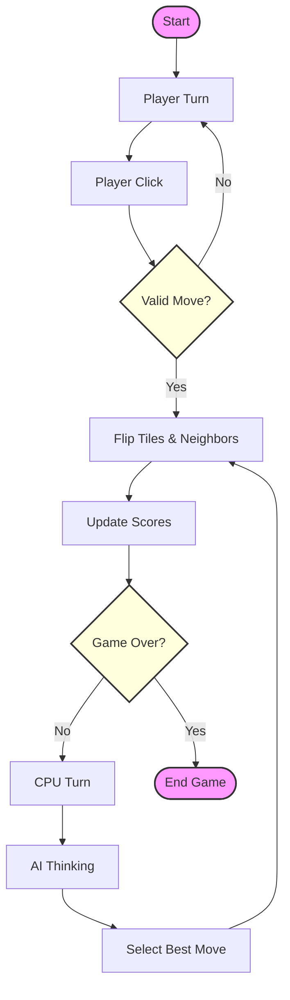
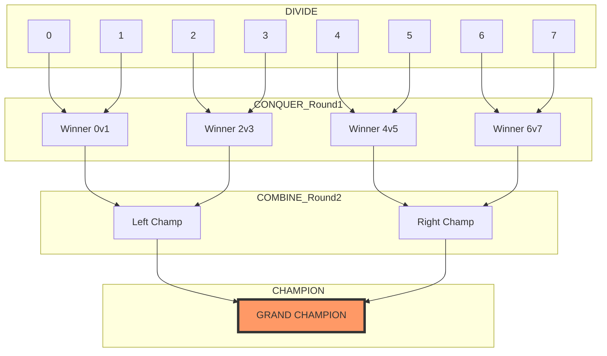

# Flip Wars — Complete Game & Algorithm Analysis (Review 2)

## 1. What Is Flip Wars?

Flip Wars is a **two-player strategic tile-flipping board game** where a human player (Yellow) battles a CPU opponent (Grey). The game demonstrates the practical use of **5 Divide & Conquer algorithms** from a DAA (Design & Analysis of Algorithms) course.

### Game Configuration

| Attribute | Value |
|-----------|-------|
| Grid Sizes | 4x4 (16 tiles), 5x5 (25 tiles), 6x6 (36 tiles) |
| Players | Human (Yellow) vs CPU (Grey) |
| Turn Limit | 15 turns (4x4), 25 turns (5x5, 6x6) |
| Win Condition | All tiles one color OR highest score at turn limit |

### Review 2 New Features
- **Version Selector:** R1 (Greedy) vs R2 (D&C) vs R3 (Coming Soon)
- **5 D&C Algorithms** for sophisticated board evaluation
- **Threat Detection D&C** for vulnerability-aware play
- **SOLVE button** for automated AI vs AI gameplay

---

## 🔄 2. How the Game Works — Step by Step

### 2.0 Game Loop Workflow



### 2.1 Game Start
When a game begins, the board is initialized with a random configuration:
```java
// Main.java — Lines 78-84
Random rand = new Random();
int initialMoves = 4 + rand.nextInt(3);  // 4-6 random flips
for (int i = 0; i < initialMoves; i++) {
    performFlip(rand.nextInt(totalTiles));
}
rules.clearMemory();  // Clear locks so no tiles start locked
```
**Why?** A random start ensures each game is unique and prevents memorized strategies.

---

### 2.2 Flip Mechanic (The Core Action)

When any tile is clicked, it flips **itself AND all 4 orthogonal neighbors** in a **plus (+) pattern**:

```
Before Click (tile 5):        After Click:
┌───┬───┬───┬───┐            ┌───┬───┬───┬───┐
│ . │ ▓ │ . │ . │            │ . │ ░ │ . │ . │  ← tile 1 flipped
├───┼───┼───┼───┤            ├───┼───┼───┼───┤
│ ▓ │[▓]│ ▓ │ . │            │ ░ │[░]│ ░ │ . │  ← tiles 4,5,6 flipped
├───┼───┼───┼───┤            ├───┼───┼───┼───┤
│ . │ ▓ │ . │ . │            │ . │ ░ │ . │ . │  ← tile 9 flipped
├───┼───┼───┼───┤            ├───┼───┼───┼───┤
│ . │ . │ . │ . │            │ . │ . │ . │ . │
└───┴───┴───┴───┘            └───┴───┴───┴───┘
```

**Code — Graph adjacency list precomputes neighbors:**
```java
// Graph.java — Lines 17-33
private void initializeGraph() {
    for (int r = 0; r < gridSize; r++) {
        for (int c = 0; c < gridSize; c++) {
            int id = r * gridSize + c;
            List<Integer> neighbors = new ArrayList<>();
            neighbors.add(id);           // Always flip self
            addIfValid(neighbors, r-1, c); // Up
            addIfValid(neighbors, r+1, c); // Down
            addIfValid(neighbors, r, c-1); // Left
            addIfValid(neighbors, r, c+1); // Right
            adjacencyList.put(id, neighbors);
        }
    }
}
```

**Why a Graph?** Neighbors are precomputed once at construction and looked up in **O(1)** during gameplay. Without this, we'd recompute neighbors on every flip.

---

### 2.3 Lock Mechanic (Tabu Search)

After a tile is clicked, it gets **LOCKED** for several turns. This prevents infinite flip loops and adds strategic depth.

```
Move History (FIFO):  [3, 7, 12, 5]
                       ↑              ↑
                    Oldest         Newest
                   (unlocks       (locked)
                    soon)

When move 9 is played:
[3, 7, 12, 5] → [7, 12, 5, 9]
  ↑ removed (unlocked!)
```

**Code — LinkedHashSet for O(1) lookup:**
```java
// Rules.java — Lines 11-41
private final LinkedHashSet<Integer> tabuSet = new LinkedHashSet<>();

public void recordMove(int tileId) {
    tabuSet.remove(tileId);    // Remove if exists
    tabuSet.add(tileId);       // Add as most recent
    if (tabuSet.size() > tabuSize) {
        Iterator<Integer> it = tabuSet.iterator();
        it.next();
        it.remove();           // Remove oldest (FIFO)
    }
}

public boolean isLocked(int tileId) {
    return tabuSet.contains(tileId); // O(1)!
}
```

**Why LinkedHashSet over LinkedList?**

| Data Structure | `contains()` | [add()](file:///d:/DAA/src/main/java/com/flipwars/Graph.java#36-41) | `remove oldest` |
|---------------|-------------|---------|-----------------|
| LinkedList | O(n) ❌ | O(1) | O(1) |
| HashSet | O(1) ✅ | O(1) | No ordering! ❌ |
| **LinkedHashSet** | **O(1) ✅** | **O(1)** | **O(1) via iterator ✅** |

---

### 2.4 Strategic Tile Scoring

Not all tiles are equal — the scoring system creates strategic depth:

```
┌──────┬──────┬──────┬──────┐
│ +25  │ +15  │ +15  │ +25  │   Corners: 25 points (hardest to flip back)
├──────┼──────┼──────┼──────┤   Edges:   15 points (stable positions)
│ +15  │  -5  │  -5  │ +15  │   Standard: 5 points (interior)
├──────┼──────┼──────┼──────┤   Traps:   -5 points (exposes corners!)
│ +15  │  -5  │  -5  │ +15  │
├──────┼──────┼──────┼──────┤
│ +25  │ +15  │ +15  │ +25  │
└──────┴──────┴──────┴──────┘
```

```java
// Rules.java — Lines 60-77
public double getTileStrategicValue(int id) {
    int r = id / gridSize, c = id % gridSize;
    if ((r == 0 || r == gridSize-1) && (c == 0 || c == gridSize-1)) return 25.0;  // Corners
    if (r == 0 || r == gridSize-1 || c == 0 || c == gridSize-1)     return 15.0;  // Edges
    if ((r <= 1 || r >= gridSize-2) && (c <= 1 || c >= gridSize-2)) return -5.0;  // Traps
    return 5.0;  // Standard
}
```

**Why negative trap tiles?** Tiles adjacent to corners are dangerous — flipping them also flips the high-value corner, giving it to the opponent.

---

## 🧠 3. The 5 Divide & Conquer Algorithms

### CPU Decision Flow

```mermaid
graph TD
    A([CPU Turn Start]) --> B{Get Valid Moves}
    B -->|Loop| C[Clone Board]
    C --> D[Simulate Flip]
    D --> E[Evaluate State]
    E --> F{Combined Score}
    F -- 40% --> G[Strategic]
    F -- 2.0x --> H[Spatial D&C]
    F -- 0.5x --> I[Cluster D&C]
    H & I & G --> F
    F --> J[Store Score]
    J --> B
    B -->|All Moves Scored| K{Selection Strategy}
    K -->|Option A| L[Merge Sort O&#40;n log n&#41;]
    K -->|Option B| M[Tournament Selection O&#40;n²&#41;]
    L --> N[Pick Best Move]
    M --> N
    N --> O([Execute Flip])
    style A fill:#f9f,stroke:#333
    style O fill:#9f9,stroke:#333
```



---

### 3.1 ALGORITHM 1: Merge Sort (Search Space D&C)

**File:** [Engine.java](file:///d:/DAA/src/main/java/com/flipwars/Engine.java) — Lines 91-127

**What:** Ranks all possible moves from best to worst score.

**D&C Steps:**
```
DIVIDE:   [85, 120, 45, 200, 30, 175, 90, 60]
                     ↓
          [85, 120, 45, 200] | [30, 175, 90, 60]
                     ↓
          [85,120] [45,200] | [30,175] [90,60]
                     ↓
          [85][120][45][200] | [30][175][90][60]

CONQUER:  Single elements are trivially sorted

COMBINE:  Merge in DESCENDING order
          [120,85] [200,45] | [175,30] [90,60]
                     ↓
          [200, 175, 120, 90, 85, 60, 45, 30]
          Best move ↑
```

**Code:**
```java
// Engine.java — Lines 92-127
private void mergeSort(List<int[]> list, int left, int right) {
    if (left < right) {
        int mid = (left + right) / 2;
        mergeSort(list, left, mid);       // DIVIDE: left half
        mergeSort(list, mid + 1, right);  // DIVIDE: right half
        merge(list, left, mid, right);    // COMBINE
    }
}

private void merge(List<int[]> list, int left, int mid, int right) {
    List<int[]> temp = new ArrayList<>();
    int i = left, j = mid + 1;
    while (i <= mid && j <= right) {
        if (list.get(i)[1] >= list.get(j)[1])
            temp.add(list.get(i++));
        else
            temp.add(list.get(j++));
    }
    while (i <= mid) temp.add(list.get(i++));
    while (j <= right) temp.add(list.get(j++));
    for (int k = 0; k < temp.size(); k++)
        list.set(left + k, temp.get(k));
}
```

**Complexity:**

| Metric | Value | Justification |
|--------|-------|---------------|
| **Time** | O(n log n) | Always splits in half, no degenerate cases |
| **Space** | O(n) | Temporary `temp` list during merge |

**Recurrence:**
```
T(n) = 2T(n/2) + O(n)
Master Theorem (Case 2): a=2, b=2, f(n)=n → T(n) = Θ(n log n)
```

**Why Merge Sort over QuickSort?**
- Guaranteed O(n log n) — no O(n²) worst case
- Stable sort — equal scores keep original order
- Clean recursive structure demonstrates D&C clearly

---

### 3.2 ALGORITHM 2: Spatial D&C (Quadrant Evaluation)

**File:** [DACAlgorithms.java](file:///d:/DAA/src/main/java/com/flipwars/DACAlgorithms.java) — Lines 31-74

**What:** Divides the board into 4 quadrants to evaluate regional control.

**D&C Steps:**
```
┌──────────┬──────────┐
│ TL (2.0×)│ TR (1.5×)│     DIVIDE:  Split into 4 sub-grids
│ Score: +2│ Score: -1│     CONQUER: Score = (our tiles) - (their tiles)
├──────────┼──────────┤     COMBINE: Weighted sum
│ BL (1.5×)│ BR (2.0×)│       Corner weight = 2.0× (TL, BR have corners)
│ Score: 0 │ Score: +3│       Edge weight   = 1.5× (TR, BL are edges)
└──────────┴──────────┘
Total = (2×2.0) + (-1×1.5) + (0×1.5) + (3×2.0) = 4 - 1.5 + 0 + 6 = 8.5
```

**Code:**
```java
// DACAlgorithms.java — Lines 31-48
public double evaluateQuadrants(boolean[] board, int gridSize, boolean forPlayer) {
    int half = gridSize / 2;
    double topLeft     = evaluateSubGrid(board, 0, 0, half, gridSize, forPlayer);
    double topRight    = evaluateSubGrid(board, 0, half, gridSize-half, gridSize, forPlayer);
    double bottomLeft  = evaluateSubGrid(board, half, 0, gridSize-half, gridSize, forPlayer);
    double bottomRight = evaluateSubGrid(board, half, half, gridSize-half, gridSize, forPlayer);

    double cornerWeight = 2.0;  // TL, BR contain board corners
    double edgeWeight   = 1.5;  // TR, BL are edge-adjacent
    return (topLeft * cornerWeight) + (topRight * edgeWeight)
         + (bottomLeft * edgeWeight) + (bottomRight * cornerWeight);
}
```

**Complexity:**

| Metric | Value | Justification |
|--------|-------|---------------|
| **Time** | O(n) | Each tile visited exactly once across 4 quadrants |
| **Space** | O(1) | Only scalar accumulators |

**Recurrence:** [T(n) = 4×T(n/4) + O(1) = O(n)](file:///d:/DAA/src/main/java/com/flipwars/Main.java#441-448)

**Why different weights?** Corner quadrants contain +25 corner tiles, making them strategically more important than edge quadrants.

---

### 3.3 ALGORITHM 3: DFS Clusters (Structural D&C)

**File:** [DACAlgorithms.java](file:///d:/DAA/src/main/java/com/flipwars/DACAlgorithms.java) — Lines 90-163

**What:** Finds connected groups of same-colored tiles via DFS. Big clusters = strong position.

**D&C Steps:**
```
Grid (█=Grey, ░=Yellow):     Clusters Found:
┌───┬───┬───┬───┐
│ █ │ ░ │ ░ │ █ │           Grey Cluster 1: {0,4}  size=2
├───┼───┼───┼───┤           Grey Cluster 2: {3,6}  size=2
│ █ │ ░ │ █ │ ░ │           Grey Cluster 3: {10}   size=1
├───┼───┼───┼───┤           Grey Cluster 4: {15}   size=1
│ ░ │ ░ │ █ │ ░ │
├───┼───┼───┼───┤           DIVIDE:   Find unvisited tile → new DFS
│ ░ │ ░ │ ░ │ █ │           CONQUER:  DFS measures each island
└───┴───┴───┴───┘           COMBINE:  Score = Σ(size²) for top 3
                            = 2² + 2² + 1² = 4 + 4 + 1 = 9
```

**DFS Recursion Tree (tile 0):**
```
dfs(0, Grey) → visited, size=1
├── dfs(UP)    → out of bounds → 0
├── dfs(DOWN=4, Grey) → visited, size=1
│   ├── dfs(UP=0) → already visited → 0
│   ├── dfs(DOWN=8) → Yellow → 0
│   ├── dfs(LEFT) → out of bounds → 0
│   └── dfs(RIGHT=5) → Yellow → 0
│   └── return 1
├── dfs(LEFT)  → out of bounds → 0
└── dfs(RIGHT=1) → Yellow → 0
Total: 1 + 1 = 2 (connected cluster)
```

**Code:**
```java
// DACAlgorithms.java — Lines 131-163
private int dfsClusterSize(boolean[] board, boolean[] visited, int id,
        int gridSize, boolean targetColor) {
    if (id < 0 || id >= board.length || visited[id] || board[id] != targetColor)
        return 0;  // BASE CASE

    visited[id] = true;
    int size = 1;
    int row = id / gridSize, col = id % gridSize;

    if (row > 0)            size += dfsClusterSize(..., id - gridSize, ...); // Up
    if (row < gridSize - 1) size += dfsClusterSize(..., id + gridSize, ...); // Down
    if (col > 0)            size += dfsClusterSize(..., id - 1, ...);        // Left
    if (col < gridSize - 1) size += dfsClusterSize(..., id + 1, ...);        // Right

    return size;  // COMBINE: 1 + all branch sizes
}
```

**Complexity:**

| Metric | Value | Justification |
|--------|-------|---------------|
| **Time** | O(V + E) = O(n) | Each tile visited once |
| **Space** | O(n) | `visited[]` array + recursion stack |

**Recurrence:** [T(V, E) = O(V + E)](file:///d:/DAA/src/main/java/com/flipwars/Main.java#441-448) — standard DFS

**Why size² scoring?** A cluster of 5 tiles scores 25, while five single tiles score 5. This rewards building large connected territories.

**Why opponent penalty 1.5×?**
```java
double clusterScore = myClusterScore - (oppClusterScore * 1.5);
```
Breaking opponent clusters is more valuable than building our own.

---

### 3.4 ALGORITHM 4: Tournament Selection (Search Space D&C)

**File:** [DACAlgorithms.java](file:///d:/DAA/src/main/java/com/flipwars/DACAlgorithms.java) — Lines 163-238

> **Status:** Implemented as an alternative move selection strategy. Available via [getBestMoveTournament()](file:///d:/DAA/src/main/java/com/flipwars/Engine.java#162-175).

**What:** Selects the best move by running a single-elimination tournament. Pairs of moves compete, and winners advance until one champion remains.

**The D&C Paradigm:**


**Code Snippet:**
```java
// DACAlgorithms.java
public int tournamentSelection(List<Integer> moves, boolean[] board, ... ) {
    // BASE CASE: 1 move left
    if (moves.size() == 1) return moves.get(0);

    // DIVIDE: Split bracket into left/right halves
    int mid = moves.size() / 2;
    List<Integer> leftBracket  = moves.subList(0, mid);
    List<Integer> rightBracket = moves.subList(mid, moves.size());

    // CONQUER: Recursively find winners
    int leftChamp  = tournamentSelection(leftBracket, board, ...);
    int rightChamp = tournamentSelection(rightBracket, board, ...);

    // COMBINE: Head-to-head comparison
    return compareMoves(leftChamp, rightChamp, board, ...);
}
```

**Complexity Analysis:**

| Metric | Value | Justification |
|--------|-------|---------------|
| **Comparisons** | O(n) | n-1 total comparisons (tournament bracket) |
| **Per Comparison** | O(n) | Each comparison simulates a flip and evaluates the full board |
| **Total Time** | O(n²) | O(n) comparisons × O(n) board evaluation per comparison |
| **Space** | O(n) | Board cloning O(n) per comparison + O(log n) recursion depth |

**Recurrence Relation:**
```
T(n) = 2T(n/2) + O(n)
                  ↑ Board simulation + evaluation in compareMoves()

Expansion:
  Level 0:  1 comparison  × O(n) = O(n)
  Level 1:  2 comparisons × O(n) = O(2n)
  Level 2:  4 comparisons × O(n) = O(4n)
  ...
  Level k:  2^k comparisons × O(n) = O(2^k × n)

  Total = O(n) × (1 + 2 + 4 + ... + n/2) = O(n) × O(n) = O(n²)
```

> **Note:** Unlike a simple max-finding tournament where comparison is O(1), each comparison here involves cloning the board, simulating a flip, and evaluating all tiles — making each comparison O(n).

**Justification — Why Tournament Selection?**
- **Search Space D&C:** Explicitly divides the *set of choices* rather than the board or time.
- **Single Winner:** Only needs the BEST move, not a full ranking. Avoids O(n² log n) cost of sorting all moves with evaluation.
- **Parallelizable:** Disjoint brackets could theoretically be evaluated in parallel threads.

---

### 3.5 ALGORITHM 5: Threat Detection D&C (Quadrant Threats)

**File:** [DACAlgorithms.java](file:///d:/DAA/src/main/java/com/flipwars/DACAlgorithms.java) — Lines 239-308

**What:** Divides the board into 4 quadrants and scores each by how many tiles are *exposed* to enemy neighbors. Positive score = opponent is more vulnerable than us.

**D&C Steps:**
```
Grid (█=our tile, ░=enemy tile):
┌───┬───┬───┬───┐
│ █ │ ░ │ █ │ █ │   For tile (0,0) █: 1 enemy neighbor (right) → our threat += 1
├───┼───┼───┼───┤   For tile (0,1) ░: 2 our neighbors (left, below?) → enemy threat += 2
│ █ │ █ │ ░ │ ░ │
├───┼───┼───┼───┤   DIVIDE:   Split into 4 quadrants
│ ░ │ █ │ █ │ ░ │   CONQUER:  For each tile, count enemy neighbors
├───┼───┼───┼───┤   COMBINE:  Score = enemy_threats - our_threats
│ ░ │ ░ │ ░ │ █ │             Weighted: corner quadrants × 2.0, edge quadrants × 1.5
└───┴───┴───┴───┘
```

**Code:**
```java
// DACAlgorithms.java — Lines 239-255
public double evaluateThreats(boolean[] board, int gridSize, boolean forPlayer) {
    int half = gridSize / 2;

    // DIVIDE: Split into 4 quadrants
    double tlThreat = evaluateQuadrantThreats(board, 0, 0, half, gridSize, forPlayer);
    double trThreat = evaluateQuadrantThreats(board, 0, half, gridSize-half, gridSize, forPlayer);
    double blThreat = evaluateQuadrantThreats(board, half, 0, gridSize-half, gridSize, forPlayer);
    double brThreat = evaluateQuadrantThreats(board, half, half, gridSize-half, gridSize, forPlayer);

    // COMBINE: Weight corner quadrants higher (strategic corners more valuable to defend)
    double cornerWeight = 2.0;
    double edgeWeight = 1.5;
    return (tlThreat * cornerWeight) + (trThreat * edgeWeight)
         + (blThreat * edgeWeight) + (brThreat * cornerWeight);
}

// DACAlgorithms.java — Lines 267-308 (Conquer step)
private double evaluateQuadrantThreats(boolean[] board, int startRow, int startCol,
        int size, int gridSize, boolean forPlayer) {
    double ourThreats = 0, enemyThreats = 0;
    boolean ourColor = forPlayer;

    for (int r = startRow; r < startRow + size && r < gridSize; r++) {
        for (int c = startCol; c < startCol + size && c < gridSize; c++) {
            int id = r * gridSize + c;
            boolean tileIsOurs = (board[id] == ourColor);

            int enemyNeighborCount = 0;
            if (r > 0 && board[(r-1)*gridSize + c] != board[id]) enemyNeighborCount++;
            if (r < gridSize-1 && board[(r+1)*gridSize + c] != board[id]) enemyNeighborCount++;
            if (c > 0 && board[r*gridSize + (c-1)] != board[id]) enemyNeighborCount++;
            if (c < gridSize-1 && board[r*gridSize + (c+1)] != board[id]) enemyNeighborCount++;

            if (enemyNeighborCount > 0) {
                if (tileIsOurs) ourThreats += enemyNeighborCount;    // Our tile exposed — BAD
                else            enemyThreats += enemyNeighborCount;  // Enemy exposed — GOOD
            }
        }
    }
    return enemyThreats - ourThreats;  // Positive = favorable
}
```

**Complexity:**

| Metric | Value | Justification |
|--------|-------|---------------|
| **Time** | O(n) | Each tile visited exactly once across 4 quadrants; neighbor check is O(1) per tile |
| **Space** | O(1) | Only scalar accumulators, no extra arrays |

**Recurrence:**
```
T(n) = 4 × T(n/4) + O(1)
     = O(n)
(Master Theorem: a=4, b=4, f(n)=O(1) → Case 1 → T(n) = Θ(n))
```

**Why Threat Detection matters:**
- A tile surrounded by enemies is *exposed* — it will likely be flipped on the next turn
- The CPU uses this (30% weight) to prioritize moves that expose the opponent while shielding its own tiles
- Corner quadrants weighted 2.0× because losing corner tiles (+25 points) is strategically devastating

---

## 4. Version Comparison (R1 vs R2)

### R1: Greedy Engine (Baseline)
- **Logic:** Simple tile-value counting (corners, edges, traps)
- **Behavior:** Grabs tiles blindly. 15% random blunder. Easily beaten.
- **Selection:** Merge Sort to pick the top move.
- **Formula:** `Score = sum(our_tiles) - sum(opponent_tiles)`

### R2: Smart D&C Engine (Current)
- **Logic:** Weighted heuristic of 4 D&C evaluations
- **Behavior:** Defends weak spots, attacks clusters, avoids bait moves
- **Selection:** Tournament Selection for CPU move (O(n²) with board evaluation)
- **Formula:**
```
FinalScore = (Strategic * 0.2) + (Spatial * 0.25) + (Cluster * 0.25) + (Threat * 0.3)
```

| Component | Weight | What It Captures |
|-----------|--------|------------------|
| Strategic | 20% | Tile position values (corners, edges, traps) |
| Quadrant (Spatial D&C) | 25% | Regional dominance |
| Cluster (DFS D&C) | 25% | Territory connectivity |
| Threat (Threat D&C) | 30% | Vulnerability / exposed tiles |

---

## 5. Complete Complexity Summary

| Algorithm | Time | Space | Recurrence |
|-----------|------|-------|------------|
| Merge Sort | O(n log n) | O(n) | T(n) = 2T(n/2) + O(n) |
| Spatial D&C | O(n) | O(1) | T(n) = 4T(n/4) + O(1) |
| DFS Clusters | O(V+E) = O(n) | O(n) | T(V,E) = O(V+E) |
| Tournament | O(n²) | O(n) | T(n) = 2T(n/2) + O(n) — each comparison evaluates full board |
| Threat Detection | O(n) | O(1) | T(n) = 4T(n/4) + O(1) |
| Tabu Lookup | O(1) | O(k) | — |

**Total per CPU move:** O(n²) where n = 16/25/36 tiles — effectively instant for small boards.

---

## 6. Architecture

```
┌─────────────────────────┐
│       Main.java         │
│  (UI + Game Loop        │
│   + Version Selector)   │
└──────┬──────────────────┘
       │ creates & delegates
       v
┌─────────────────────────┐         ┌──────────────────────────┐
│      Engine.java        │────────>│   DACAlgorithms.java     │
│  (AI Logic:             │         │  (4 D&C Algorithms:      │
│   R1 Greedy +           │         │   Spatial + DFS +        │
│   R2 D&C +              │         │   Tournament + Threat)   │
│   Merge Sort)           │         └──────┬───────────────────┘
└──────┬──────────────────┘                │
       │                                   │
       │    uses                     uses   │
       v                                   v
┌─────────────────┐           ┌────────────────────┐
│   Graph.java    │           │    Rules.java      │
│ (Adjacency      │           │  (Tabu + Scoring)  │
│  Lists)         │           │                    │
└─────────────────┘           └────────────────────┘
```

**Dependency Summary:**
- **Main.java** → Engine.java, Graph.java, Rules.java, DACAlgorithms.java
- **Engine.java** → Graph.java, Rules.java, DACAlgorithms.java
- **DACAlgorithms.java** → Graph.java, Rules.java (via `tournamentSelection` parameters)
- **Graph.java** → *(no internal dependencies — standalone)*
- **Rules.java** → *(no internal dependencies — standalone)*

> **Note:** `Graph.java` and `Rules.java` are independent of each other. Both are leaf dependencies used by the upper layers.

---

## 7. Conclusion

| # | Algorithm | D&C Type | What It Divides | Used For |
|---|-----------|----------|-----------------|----------|
| 1 | **Merge Sort** | Search Space | List of scored moves | Player Hints (R1 + R2) |
| 2 | **Spatial D&C** | Spatial | Physical board -> quadrants | Board scoring (25%) |
| 3 | **DFS Clusters** | Structural | Board -> connected components | Board scoring (25%) |
| 4 | **Tournament Selection** | Search Space | Moves list -> Brackets | CPU move selection |
| 5 | **Threat Detection** | Scoring/Spatial | Board -> quadrant threats | Board scoring (30%) |

**Key Takeaway:** Combining multiple D&C strategies creates a more robust AI than any single algorithm alone. The Version Selector demonstrates clear improvement from R1 (Greedy) to R2 (D&C).

### Future Roadmap (Review 3)
- **Backtracking / Minimax:** Depth-3 lookahead for multi-turn planning
- **Dynamic Programming:** Transposition table for board state caching
