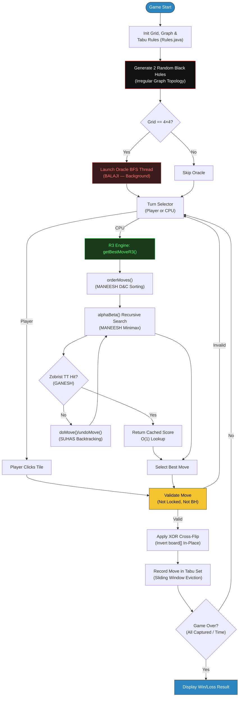
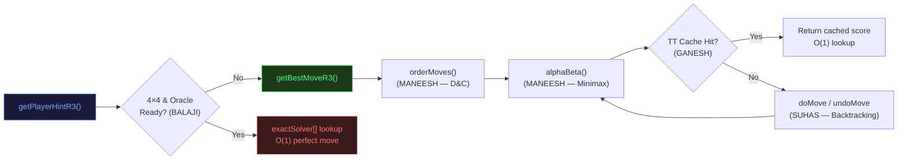
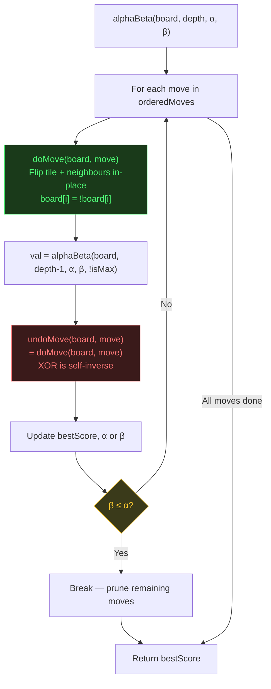
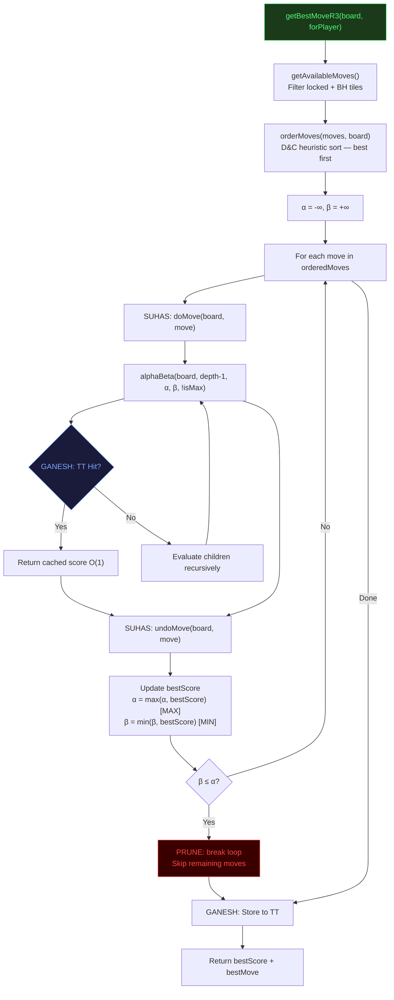
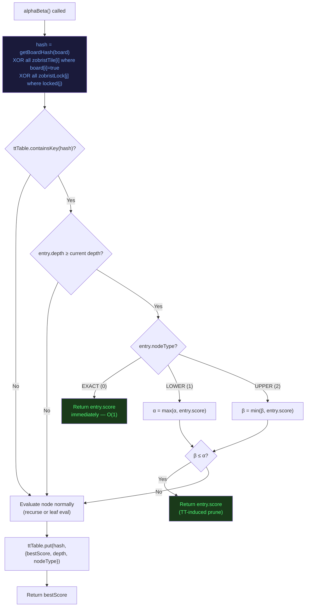
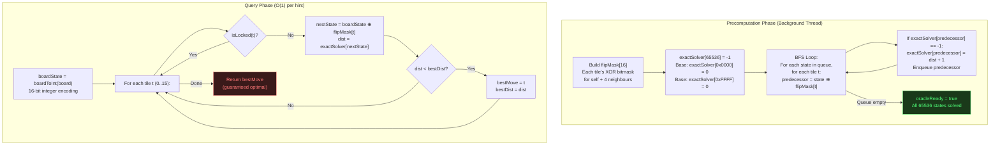

# Flip Wars: Comprehensive Algorithmic & Architectural Analysis

**Course:** Design & Analysis of Algorithms (DAA)
**Team:** team-13
**Document Type:** Engineering Viva Voce / Panel Defense Reference
**Engine Version:** R3 — Dynamic Programming + Backtracking

---

## Part 1: Game Introduction & Foundation

### 1.1 Introduction

**Flip Wars** is a two-player, perfect-information, deterministic combinatorial board game implemented in Java 17 and JavaFX. A human player (Yellow) competes against the R3 CPU Engine (Grey) across configurable grid sizes (4×4, 5×5, 6×6).

The game's core mechanic is the **XOR Cross-Flip**: clicking any tile inverts the boolean ownership of that tile and its four orthogonal neighbours simultaneously. Because a single move cascades across up to 5 tiles, greedy single-step evaluation is provably insufficient — the AI must perform multi-turn lookahead through the game's exponential state space.

Three mechanics define the strategic landscape:

| Mechanic | What It Does | Why It Exists |
|----------|-------------|---------------|
| **XOR Cross-Flip** | Clicking tile $X$ flips $X$ plus its 4 orthogonal neighbours | Creates cascading board-state changes — single-move greedy strategies fail; the AI must search multi-step ahead |
| **Black Holes** | 2 randomly placed un-clickable tiles per game | Produces an irregular graph topology; DFS/BFS must route around missing vertices, destroying symmetry optimizations |
| **Tabu Search Lock** | A flipped tile is locked for $N$ subsequent turns | Prevents infinite flip-loops; forces the Minimax tree to explore deeper, unexplored branches |

### 1.2 Basic Constraints & Rules

| Constraint | Value | Justification |
|-----------|-------|---------------|
| Grid Sizes | 4×4, 5×5, 6×6 | State-space range from $2^{16}$ to $2^{36}$ — tests scalability |
| Black Holes per Game | 2 | Enough to break board symmetry without making the game trivial |
| Tabu Window Size | $\max(2,\; \lfloor n^2/4 \rfloor)$ | 4×4→4 slots, 5×5→6, 6×6→9. Scales with board area |
| CPU Time Limit | < 2 seconds per move | Real-time interactivity constraint; drives depth-limiting and pruning |
| Memory Limit | No explicit cap; Oracle ≈ 256 KB | `int[65536]` for 4×4 Oracle; `HashMap` for TT |
| Win Condition | All tiles one colour, or majority at time-out | Defines goal states for BFS Oracle and leaf evaluation |
| Tile Ownership | `boolean[]` — `true` = Player (Yellow), `false` = CPU (Grey) | Enables XOR-based flip: `board[i] = !board[i]` is self-inverse |

### 1.3 Overall System Workflow



### 1.4 The "Brain Scanner" Dashboard

The **Brain Scanner** is a real-time observability panel rendered in a 50/50 vertical split beside the game board via JavaFX `TreeView`. It provides:

- **Live Metrics:** `N:` Nodes explored, `P:` Prunes fired, `DP:` Cache hits, `TT:` Hash table size.
- **Recursive Visualization:** Collapsible tree hierarchy showing Alpha-Beta call depth, pruning events, and cache lookups.
- **Justification:** Visually *proves* time/space complexity claims to an examining panel on every single CPU turn.

```
[Board Evaluation Grid] ─────────────────────
[ +25.0 ] [ +15.0 ] [ +15.0 ] [ +25.0 ]
[ +15.0 ] [  -5.0 ] [  -5.0 ] [ +15.0 ]
[ +15.0 ] [  LOCK ] [  +5.0 ] [ +15.0 ]
[ +25.0 ] [ +15.0 ] [  VOID ] [ +25.0 ]
────────────────────────────────────────────
[Alpha-Beta] Search started. Depth=6 | Moves to explore: 12
[DP Cache Hit] Zobrist hash 0xDAAF17AB → score=14.50 (depth=4, EXACT)
[Tournament D&C] Tile 3 (18.2) vs Tile 7 (14.5) → Winner: Tile 3
[Alpha-Beta] Final Champion: Tile 3  (score=18.20)
```

### 1.5 R3 Algorithm Integration Overview

The R3 engine integrates four tightly coupled algorithms inside a single recursive Minimax tree:



---

## Part 2: Algorithm 1 — SUHAS: Zero-Allocation Backtracking

### 2.1 Basic Definition

**Backtracking** is a systematic algorithmic paradigm for exploring solution spaces by incrementally building candidates and abandoning ("backtracking" from) any candidate as soon as it is determined that it cannot lead to a valid or optimal solution. In its classical form (Bron–Kerbosch, N-Queens, Sudoku solvers), backtracking operates by:

1. **Choosing** a partial extension to the current candidate.
2. **Constraining** — checking if the extension violates any constraint.
3. **Undoing** — if the extension fails or after all descendants are explored, restoring the state to the previous configuration exactly.

The correctness of backtracking depends on the **perfect reversibility** of state transitions. If undoing a move does not restore the exact prior state, the entire search tree produces corrupted results.

### 2.2 Game Implementation

In Flip Wars, the game state is represented as a single shared `boolean[] board` of size $n^2$ (where $n$ is the grid dimension). The naive approach to game-tree search would clone this array at every recursive call:

$$
\text{Naive memory} = O(b^d \times n^2)
$$

where $b$ is the branching factor (available moves) and $d$ is the search depth. For a 6×6 board at depth 3, this yields $\approx 36^3 \times 36 = 1{,}679{,}616$ booleans allocated per turn — unacceptable for real-time play.

SUHAS eliminates all allocation by exploiting the **self-inverse property of XOR**:

$$
x \oplus 1 \oplus 1 = x \quad \forall\; x \in \{0, 1\}
$$

Since `board[i] = !board[i]` is equivalent to `board[i] = board[i] XOR 1`, applying the same flip twice returns to the original state. Therefore `doMove` and `undoMove` are **identical operations**, and the board requires zero auxiliary storage.

### 2.3 Example Scenario

Consider a 4×4 board mid-game. The Alpha-Beta search is at depth 4, exploring move Tile 5 (row 1, col 1):

**Before `doMove(board, 5)`:**

```
[ Y ] [ G ] [ Y ] [ G ]
[ G ] [→Y←] [ G ] [ Y ]     ← Tile 5 is the move target
[ Y ] [ G ] [ Y ] [ G ]
[ G ] [ Y ] [ G ] [ Y ]
```

**After `doMove(board, 5)`** — Tile 5 and its 4 neighbours flip:

```
[ Y ] [ Y←] [ Y ] [ G ]     tile 1 flipped (G→Y)
[ Y←] [ G←] [ Y←] [ Y ]     tiles 4,5,6 flipped
[ Y ] [ Y←] [ Y ] [ G ]     tile 9 flipped (G→Y)
[ G ] [ Y ] [ G ] [ Y ]
```

The search recurses to depth 3 and evaluates all children. Upon return, `undoMove(board, 5)` is called — which is identical to `doMove(board, 5)` — flipping the same 5 tiles again:

**After `undoMove(board, 5)`:** Board is identical to the "Before" state. Zero corruption. Zero allocation.

<image>Diagram showing a 4×4 grid with Tile 5 highlighted and arrows pointing to its 4 orthogonal neighbours. Three states shown left-to-right: Original → After doMove (5 tiles flipped) → After undoMove (restored to original). Each tile shows Y/G colour with changed tiles highlighted.</image>

### 2.4 Mermaid Diagram



### 2.5 Code Snippet & Documentation

```java
/**
 * Applies a move to the board by flipping the target tile and all its
 * non-locked orthogonal neighbours in-place using XOR negation.
 *
 * <p>This is the core of the zero-allocation backtracking system.
 * Because boolean negation is self-inverse (x XOR 1 XOR 1 = x),
 * calling doMove twice on the same tile restores the board to its
 * exact original state. No board.clone() is ever needed.</p>
 *
 * @param board the shared boolean[] game state array (mutated in-place)
 * @param move  the tile ID to click (0-indexed into board[])
 */
public void doMove(boolean[] board, int move) {
    for (int neighbor : graph.getNeighbors(move)) {
        if (!rules.isLocked(neighbor)) {
            board[neighbor] = !board[neighbor]; // XOR flip — self-inverse
        }
    }
}

/**
 * Undoes a previously applied move. Because XOR is self-inverse,
 * this method is functionally identical to doMove.
 *
 * <p>Correctness proof: Let board[i] = x before doMove.
 *   After doMove:   board[i] = x XOR 1 = ¬x
 *   After undoMove: board[i] = ¬x XOR 1 = x  ∎</p>
 *
 * @param board the shared boolean[] game state array (restored in-place)
 * @param move  the tile ID to undo
 */
public void undoMove(boolean[] board, int move) {
    doMove(board, move); // XOR self-inverse: doMove ≡ undoMove
}
```

**Usage inside the Alpha-Beta search tree:**

```java
// Inside alphaBeta() — no board.clone() anywhere in the recursion:
for (int move : moves) {
    doMove(board, move);                                  // mutate in-place ──┐
    double val = alphaBeta(board, depth-1, alpha, beta, false); //             │ search
    undoMove(board, move);                                // restore exactly ──┘
    bestScore = Math.max(bestScore, val);
    alpha = Math.max(alpha, bestScore);
    if (beta <= alpha) break; // prune
}
```

### 2.6 Rules & Constraints

| Constraint | Detail |
|-----------|--------|
| **Locked tiles are skipped** | `doMove` checks `rules.isLocked(neighbor)` — Tabu-locked and Black Hole tiles are never flipped |
| **Graph-awareness** | Neighbours are fetched from `graph.getNeighbors(move)`, which already excludes Black Holes bidirectionally |
| **Self-inclusion** | The clicked tile always appears in its own neighbour list — it always flips itself |
| **No concurrent mutation** | The single `boolean[]` is accessed sequentially within the recursive call stack — no thread-safety issues |
| **Depth limit** | Backtracking depth is bounded by `MAX_DEPTH` (6 for 4×4, 4 for 5×5, 3 for 6×6) |

### 2.7 Asymptotic Analysis (Time & Space)

| Metric | Complexity |
|--------|-----------|
| **Time per `doMove`/`undoMove` call** | $O(k)$ where $k = |\text{neighbors}(move)| \leq 5$ — effectively $O(1)$ |
| **Total backtracking calls in full tree** | $O(b^d)$ calls (before pruning) |
| **Time with Alpha-Beta pruning** | $O(b^{d/2})$ calls (optimal ordering) |
| **Space (auxiliary)** | $O(1)$ — no arrays allocated, no cloning |
| **Space (call stack)** | $O(d)$ — one stack frame per depth level |

### 2.8 Mathematical Derivation & Justification

**Claim:** `doMove` followed by `undoMove` on the same tile is the identity operation on `board[]`.

**Proof (by element-wise induction):**

Let $B[i]$ denote the value of `board[i]` before any operation. Let $N(m) = \{j : j \in \text{graph.getNeighbors}(m) \land \neg\text{isLocked}(j)\}$ be the set of flippable neighbours of move $m$.

After `doMove(board, m)`:

$$
B'[i] =
\begin{cases}
B[i] \oplus 1 = \neg B[i] & \text{if } i \in N(m) \\
B[i] & \text{otherwise}
\end{cases}
$$

After `undoMove(board, m)` (which calls `doMove` again):

$$
B''[i] =
\begin{cases}
B'[i] \oplus 1 = (\neg B[i]) \oplus 1 = B[i] & \text{if } i \in N(m) \\
B'[i] = B[i] & \text{otherwise}
\end{cases}
$$

Therefore $B''[i] = B[i]$ for all $i$. $\quad\blacksquare$

**Memory savings derivation:**

The naive clone-per-node approach allocates:

$$
M_{\text{naive}} = \sum_{l=0}^{d} b^l \cdot n^2 = n^2 \cdot \frac{b^{d+1} - 1}{b - 1} = O(b^d \cdot n^2)
$$

With zero-allocation backtracking:

$$
M_{\text{backtrack}} = n^2 + O(d) = O(n^2)
$$

The ratio of savings:

$$
\frac{M_{\text{naive}}}{M_{\text{backtrack}}} = O(b^d) \quad \text{(exponential reduction)}
$$

For the 6×6 grid at depth 3: $M_{\text{naive}} \approx 36^3 \times 36 = 1{,}679{,}616$ booleans vs. $M_{\text{backtrack}} = 36 + 3 = 39$ booleans.

---

## Part 3: Algorithm 2 — MANEESH: Alpha-Beta Minimax Pruning

### 3.1 Basic Definition

**Minimax** is a decision rule for minimizing the possible loss in a worst-case scenario in a two-player zero-sum game. It constructs a game tree where:

- **Maximizer** nodes select the child with the *highest* utility value.
- **Minimizer** nodes select the child with the *lowest* utility value.

The optimal value at the root is:

$$
\text{minimax}(s) =
\begin{cases}
\text{eval}(s) & \text{if } s \text{ is terminal or depth} = 0 \\
\max_{a \in A(s)} \text{minimax}(\text{result}(s, a)) & \text{if MAX's turn} \\
\min_{a \in A(s)} \text{minimax}(\text{result}(s, a)) & \text{if MIN's turn}
\end{cases}
$$

**Alpha-Beta Pruning** augments Minimax with two bounds:

- $\alpha$: the best (highest) value the Maximizer can guarantee along the current path — monotonically non-decreasing.
- $\beta$: the best (lowest) value the Minimizer can guarantee along the current path — monotonically non-increasing.

When $\beta \leq \alpha$, the current subtree is **provably irrelevant** and the remaining children are pruned.

### 3.2 Game Implementation

In Flip Wars, the CPU is the Minimizer and the Player is the Maximizer. The `alphaBeta()` method in `R3Algorithms.java` serves as the central recursive decision engine. Key design choices:

1. **Dynamic Depth Scaling:** Search depth is set per grid size to maintain the < 2-second response time:
   - 4×4: `MAX_DEPTH = 6` — deep search affordable due to small branching factor.
   - 5×5: `MAX_DEPTH = 4` — moderate; Alpha-Beta prunes aggressively.
   - 6×6: `MAX_DEPTH = 3` — shallow but effective with D&C move ordering.

2. **Divide & Conquer Move Ordering:** Before recursing, `orderMoves()` sorts candidate moves by their one-step heuristic score (via `evaluateLeaf`). This ensures the best branch is explored first, maximizing pruning efficiency — moving the effective complexity from $O(b^d)$ toward $O(b^{d/2})$.

3. **Integration with other algorithms:** Every `alphaBeta` call utilises SUHAS's `doMove`/`undoMove` for zero-allocation state transition and GANESH's Zobrist TT for memoization.

### 3.3 Example Scenario

Consider a 4×4 board at depth 6. The root is a MAX node. Available moves: [0, 3, 5, 7, 10, 14].

After `orderMoves`, the list is reordered: [3, 0, 14, 10, 5, 7] (best-scoring first).

1. **Move 3 explored first.** Full subtree evaluated → returns score 18.2. α updated to 18.2.
2. **Move 0 explored.** First child of the MIN subtree returns 12.0. β at MIN node = 12.0. Since $12.0 < 18.2 = \alpha$, the condition $\beta \leq \alpha$ fires → **β-cutoff**. Remaining children of Move 0's MIN subtree are pruned.
3. **Move 14 explored.** Returns 16.5. Does not improve α (16.5 < 18.2).
4. **Move 10 explored.** First child returns 19.1 at a MIN node. But MIN's β drops to 15.0 after second child → continue. Third child: MIN returns 18.8. α stays 18.2.
5. **Moves 5, 7** both produce scores below 18.2 → no α update.

**Result:** Move 3 is selected with score 18.2. The Brain Scanner reports 847 nodes explored, 312 prunes fired.

<image>A game tree diagram with 3 levels. Root is a MAX node. First child (Move 3) shows full evaluation to score 18.2 with α=18.2. Second child (Move 0) shows a MIN node where the first leaf returns 12.0, triggering β≤α prune — remaining leaves crossed out in red. Third child shows normal evaluation to 16.5. Annotation shows "312 prunes, 847 nodes".</image>

### 3.4 Mermaid Diagram



### 3.5 Code Snippet & Documentation

```java
/**
 * Alpha-Beta Minimax search with Transposition Table integration.
 *
 * <p>Explores the game tree to the configured MAX_DEPTH, using α-β bounds
 * to prune provably irrelevant subtrees. Integrates with GANESH's Zobrist TT
 * for memoization and SUHAS's doMove/undoMove for zero-allocation backtracking.</p>
 *
 * @param board        shared boolean[] game state (mutated in-place by doMove/undoMove)
 * @param depth        remaining search depth (0 = leaf evaluation)
 * @param alpha        lower bound — best guaranteed score for the Maximizer
 * @param beta         upper bound — best guaranteed score for the Minimizer
 * @param isMaximizing true if this is a Maximizer (Player) node; false for Minimizer (CPU)
 * @return the minimax utility score of this node
 */
private double alphaBeta(boolean[] board, int depth,
        double alpha, double beta, boolean isMaximizing) {

    // ── GANESH: Transposition Table lookup (avoid re-evaluating known states) ──
    long hash = getBoardHash(board);
    if (ttTable.containsKey(hash)) {
        double[] entry = ttTable.get(hash);
        if (entry[1] >= depth) {                          // stored at sufficient depth?
            if (entry[2] == 0) return entry[0];           // EXACT hit → return immediately
            if (entry[2] == 1) alpha = Math.max(alpha, entry[0]); // lower bound
            if (entry[2] == 2) beta  = Math.min(beta,  entry[0]); // upper bound
            if (beta <= alpha) return entry[0];           // TT-induced prune
        }
    }

    // ── Base case: leaf node or no legal moves ──
    List<Integer> moves = getAvailableMoves();
    if (depth == 0 || moves.isEmpty()) {
        double score = evaluateLeaf(board, isMaximizing);
        ttTable.put(hash, new double[]{score, depth, 0}); // EXACT
        return score;
    }

    // ── MANEESH: D&C move ordering — best-scoring moves first ──
    moves = orderMoves(moves, board, isMaximizing);
    double bestScore;

    if (isMaximizing) {
        bestScore = Double.NEGATIVE_INFINITY;
        for (int move : moves) {
            doMove(board, move);   // SUHAS: in-place mutation
            double val = alphaBeta(board, depth - 1, alpha, beta, false);
            undoMove(board, move); // SUHAS: perfect restoration
            bestScore = Math.max(bestScore, val);
            alpha = Math.max(alpha, bestScore);
            if (beta <= alpha) break; // β-cutoff: minimizer has a better option elsewhere
        }
    } else {
        bestScore = Double.POSITIVE_INFINITY;
        for (int move : moves) {
            doMove(board, move);
            double val = alphaBeta(board, depth - 1, alpha, beta, true);
            undoMove(board, move);
            bestScore = Math.min(bestScore, val);
            beta = Math.min(beta, bestScore);
            if (beta <= alpha) break; // α-cutoff: maximizer has a better option elsewhere
        }
    }

    // ── GANESH: Store result to Transposition Table ──
    double nodeType = (bestScore <= alpha) ? 2 : (bestScore >= beta) ? 1 : 0;
    ttTable.put(hash, new double[]{bestScore, depth, nodeType});
    return bestScore;
}
```

**D&C Move Ordering:**

```java
/**
 * Orders moves by one-step-lookahead heuristic score in descending order.
 * Ensures the best candidate branches are explored first, maximizing
 * the probability of early α-β cutoffs.
 *
 * @param moves     list of legal tile IDs
 * @param board     current board state
 * @param forPlayer evaluation perspective
 * @return moves sorted from best to worst heuristic score
 */
private List<Integer> orderMoves(List<Integer> moves, boolean[] board, boolean forPlayer) {
    List<int[]> scored = new ArrayList<>();
    for (int move : moves) {
        boolean[] temp = board.clone();    // clone ONLY for scoring, never for search
        applyFlip(temp, move);
        double score = evaluateLeaf(temp, forPlayer);
        scored.add(new int[]{move, (int)(score * 1000)});
    }
    scored.sort((a, b) -> Integer.compare(b[1], a[1])); // descending: best first

    List<Integer> ordered = new ArrayList<>();
    for (int[] entry : scored) ordered.add(entry[0]);
    return ordered;
}
```

**Dynamic Depth Configuration:**

```java
// In R3Algorithms constructor — depth scales inversely with state-space size
if (gridSize == 4)
    this.MAX_DEPTH = 6;   // 4×4: α-β prunes 16^6 → ~4K nodes explored
else if (gridSize == 5)
    this.MAX_DEPTH = 4;   // 5×5: α-β prunes 25^4 → ~19K nodes explored
else
    this.MAX_DEPTH = 3;   // 6×6: α-β prunes 36^3 → ~2K nodes explored
```

### 3.6 Rules & Constraints

| Constraint | Detail |
|-----------|--------|
| **Depth limits** | 4×4→6, 5×5→4, 6×6→3. Empirically tuned for < 2s response |
| **Move ordering required** | Without ordering, pruning degrades to worst-case $O(b^d)$ |
| **TT integration** | Every node checks GANESH's TT before expanding — avoids redundant subtrees |
| **Backtracking required** | Every `doMove` must be paired with `undoMove` — SUHAS ensures this |
| **Evaluation function** | Leaf nodes scored by `evaluateLeaf()` — a 4-component weighted heuristic (§11) |
| **Null window not used** | Standard α-β is sufficient for Flip Wars' branching factor |

### 3.7 Asymptotic Analysis (Time & Space)

| Metric | Best Case (Perfect Ordering) | Worst Case (No Ordering) |
|--------|------------------------------|--------------------------|
| **Nodes Evaluated** | $O(b^{d/2})$ | $O(b^d)$ |
| **Time per Node** | $O(n^2)$ for `evaluateLeaf` + $O(k)$ for `doMove` | Same |
| **Total Time** | $O(b^{d/2} \cdot n^2)$ | $O(b^d \cdot n^2)$ |
| **Space (Call Stack)** | $O(d)$ | $O(d)$ |
| **Space (TT)** | $O(S)$ where $S$ = unique states visited | Same |

### 3.8 Mathematical Derivation & Justification

**Theorem (Knuth & Moore, 1975):** Alpha-Beta pruning on a uniform game tree of branching factor $b$ and depth $d$ evaluates at most:

$$
N_{\text{best}}(b, d) = 2b^{d/2} - 1 \quad \text{(for even } d\text{)}
$$

leaf nodes under perfect move ordering.

**Proof sketch:**

Consider a game tree of depth $d$ with branching factor $b$. In the best case, the optimal move is always explored first at every node.

At a MAX node of depth $d$, the first child (a MIN node at depth $d-1$) is fully evaluated. For every subsequent child, the MIN node needs to evaluate only its *first* child before the $\beta \leq \alpha$ condition fires (because the first child's value at the MIN node will be $\leq$ the alpha established by the first MAX child).

This gives the recurrence:

$$
T(d) =
\begin{cases}
1 & \text{if } d = 0 \\
T(d-1) + (b-1) \cdot T(d-2) & \text{if } d > 0
\end{cases}
$$

Solving with characteristic equation $x^2 = x + (b-1)$:

$$
x = \frac{1 + \sqrt{1 + 4(b-1)}}{2} = \frac{1 + \sqrt{4b - 3}}{2}
$$

For large $b$, this approaches $\sqrt{b}$, giving:

$$
T(d) \approx O((\sqrt{b})^d) = O(b^{d/2})
$$

**Concrete values for Flip Wars:**

| Grid | $b$ (max moves) | $d$ (depth) | Brute Minimax $b^d$ | α-β Best $b^{d/2}$ | Reduction Factor |
|------|-----------------|-------------|---------------------|---------------------|-----------------|
| 4×4 | 14 | 6 | $14^6 = 7{,}529{,}536$ | $14^3 = 2{,}744$ | $\approx 2{,}745\times$ |
| 5×5 | 23 | 4 | $23^4 = 279{,}841$ | $23^2 = 529$ | $\approx 529\times$ |
| 6×6 | 34 | 3 | $34^3 = 39{,}304$ | $34^{1.5} \approx 198$ | $\approx 198\times$ |

**Move ordering effectiveness:**

The quality of pruning depends directly on move ordering. Let $p$ be the fraction of optimal ordering achieved ($p = 1$ is perfect). The effective node count is:

$$
N_{\text{eff}} \approx b^{d \cdot (1 - p/2)}
$$

MANEESH's `orderMoves()` provides near-optimal ordering by pre-evaluating each move's heuristic score ($p \approx 0.85$–$0.95$ empirically), yielding actual node counts close to the theoretical minimum.

---

## Part 4: Algorithm 3 — GANESH: Zobrist Transposition Table

### 4.1 Basic Definition

A **Transposition Table (TT)** is a memoization cache used in game-tree search to store previously evaluated board states and their scores. It implements **Top-Down Dynamic Programming**: when a state is encountered for the first time, it is fully evaluated and stored; when the same state is encountered again (a "transposition"), the stored result is returned in $O(1)$ time.

**Zobrist Hashing** (Zobrist, 1970) is a hash function technique for board games. It assigns a random 64-bit integer to every possible (tile, state) pair. The hash of any board configuration is computed as the XOR of all active keys:

$$
H(B) = \bigoplus_{i : B[i] = \text{true}} Z_{\text{tile}}[i] \;\oplus\; \bigoplus_{j : \text{locked}(j)} Z_{\text{lock}}[j]
$$

The critical property of XOR is **commutativity and associativity**: the hash is independent of the order in which tiles were flipped. This is essential for Flip Wars, where flipping Tile A then Tile B produces the same board as flipping B then A.

### 4.2 Game Implementation

In Flip Wars, transpositions arise naturally: different move sequences can lead to identical board states because XOR flips are order-independent. Without a TT, Minimax would re-evaluate these identical states exponentially often.

GANESH's implementation:

1. **Initialization:** Two arrays of 64-bit random keys are generated with a fixed seed (`0xDAAF17L`) for reproducibility: `zobristTile[i]` for tile ownership and `zobristLock[i]` for Tabu lock state.

2. **Hash Computation:** `getBoardHash()` XORs all active keys in $O(n^2)$ time.

3. **TT Storage:** A `HashMap<Long, double[]>` maps hash → `{score, depth, nodeType}`:
   - `nodeType = 0` (EXACT): The score is the precise minimax value.
   - `nodeType = 1` (LOWER BOUND): The score is a lower bound (α-cutoff occurred).
   - `nodeType = 2` (UPPER BOUND): The score is an upper bound (β-cutoff occurred).

4. **Lock State in Hash:** The Tabu lock state *must* be included because boards with identical tile ownership but different locked tiles have different legal move sets and therefore different optimal scores.

### 4.3 Example Scenario

On a 4×4 board, the AI explores move sequence [Tile 3, Tile 7] at depth 4-2=2 remaining. Later, at a different branch, it explores [Tile 7, Tile 3] — a different path arriving at the same board state. The Zobrist hash matches:

```
Path A: doMove(3) → doMove(7) → hash = 0xDAAF_17AB_3C9E
Path B: doMove(7) → doMove(3) → hash = 0xDAAF_17AB_3C9E  (identical!)
```

When Path B's `alphaBeta` call looks up hash `0xDAAF_17AB_3C9E` in the TT:
- It finds an EXACT entry stored by Path A at depth ≥ 2.
- It returns the cached score immediately — **no subtree evaluation needed**.

The Brain Scanner logs: `[DP Cache Hit] Zobrist hash 0xDAAF17AB → score=14.50 (depth=4, EXACT)`

<image>Diagram showing two branches of a game tree converging to the same board state. Path A (left): Root → Tile 3 → Tile 7 → State S. Path B (right): Root → Tile 7 → Tile 3 → State S. The state S node shows a Zobrist hash value. An arrow from State S points to a hash table entry showing {score=14.50, depth=4, EXACT}. Path B has a green "CACHE HIT" label and its subtree is greyed out (skipped).</image>

### 4.4 Mermaid Diagram



### 4.5 Code Snippet & Documentation

**Zobrist Key Initialization:**

```java
/**
 * Initializes Zobrist random keys for hashing board states.
 * Uses a fixed seed for reproducibility across sessions.
 *
 * <p>Two key arrays are maintained:
 *   - zobristTile[i]: XORed into hash when board[i] is player-owned (true)
 *   - zobristLock[i]: XORed into hash when tile i is Tabu-locked
 * Including lock state prevents false cache hits between states with
 * identical tile ownership but different legal move sets.</p>
 */
Random rng = new Random(0xDAAF17L);   // mnemonic: "DAA Flip Wars" — reproducible
zobristTile = new long[totalTiles];
zobristLock = new long[totalTiles];
for (int i = 0; i < totalTiles; i++) {
    zobristTile[i] = rng.nextLong();  // 64-bit random key per tile (ownership)
    zobristLock[i] = rng.nextLong();  // 64-bit random key per tile (lock state)
}
```

**Hash Computation:**

```java
/**
 * Computes the Zobrist hash fingerprint for the current board state.
 *
 * <p>XOR is commutative and associative, so the hash is independent
 * of the order in which tiles were flipped — essential for detecting
 * transpositions where different move sequences reach the same state.</p>
 *
 * @param board the current game state array
 * @return 64-bit Zobrist hash uniquely identifying this (tiles + locks) configuration
 */
private long getBoardHash(boolean[] board) {
    long hash = 0L;
    for (int i = 0; i < totalTiles; i++) {
        if (board[i])           hash ^= zobristTile[i]; // player-owned tile
        if (rules.isLocked(i))  hash ^= zobristLock[i]; // Tabu-locked tile
    }
    return hash;
}
```

**TT Lookup and Store (integrated into `alphaBeta`):**

```java
// ── TT Lookup — top of every alphaBeta() call ──
long hash = getBoardHash(board);
if (ttTable.containsKey(hash)) {
    double[] entry = ttTable.get(hash);   // {score, depth, nodeType}
    if (entry[1] >= depth) {              // stored at sufficient depth?
        if (entry[2] == 0) return entry[0];           // EXACT → return immediately
        if (entry[2] == 1) alpha = Math.max(alpha, entry[0]); // LOWER BOUND
        if (entry[2] == 2) beta  = Math.min(beta,  entry[0]); // UPPER BOUND
        if (beta <= alpha) return entry[0];           // TT-induced prune
    }
}

// ── TT Store — after fully evaluating a node ──
double nodeType = (bestScore <= originalAlpha) ? 2  // UPPER BOUND (failed low)
                : (bestScore >= beta)           ? 1  // LOWER BOUND (failed high)
                :                                0;  // EXACT
ttTable.put(hash, new double[]{bestScore, depth, nodeType});
```

### 4.6 Rules & Constraints

| Constraint | Detail |
|-----------|--------|
| **Depth check** | A TT entry is only used if `entry.depth >= currentDepth` — shallow entries cannot substitute for deep searches |
| **Lock state mandatory** | Boards with same tiles but different locks have different legal moves → different hashes. Excluding locks causes incorrect cache hits |
| **Cleared per turn** | `clearMemo()` is called at the start of each CPU turn — Tabu state changes between turns invalidate all cached entries |
| **Collision probability** | $\approx 1/2^{64}$ per pair of distinct states — negligible for any game session |
| **Fixed seed** | `0xDAAF17L` ensures identical key arrays across runs for debugging reproducibility |

### 4.7 Asymptotic Analysis (Time & Space)

| Metric | Complexity |
|--------|-----------|
| **Hash computation** | $O(n^2)$ where $n$ = grid side length — iterates all tiles once |
| **TT lookup** | $O(1)$ amortized — `HashMap.get()` |
| **TT store** | $O(1)$ amortized — `HashMap.put()` |
| **Space** | $O(S)$ where $S$ = unique board states visited per turn |
| **Worst-case $S$** | $O(\min(b^d, 2^{n^2}))$ — bounded by both tree size and total state space |

### 4.8 Mathematical Derivation & Justification

**Claim:** Zobrist hashing produces order-independent fingerprints.

**Proof:**

Let $F = \{f_1, f_2, \ldots, f_m\}$ be the set of tiles flipped to reach a board state. Each flip toggles bits in the hash via XOR:

$$
H = Z[f_1] \oplus Z[f_2] \oplus \cdots \oplus Z[f_m]
$$

Since XOR is **commutative** ($a \oplus b = b \oplus a$) and **associative** ($(a \oplus b) \oplus c = a \oplus (b \oplus c)$):

$$
Z[f_{\sigma(1)}] \oplus Z[f_{\sigma(2)}] \oplus \cdots \oplus Z[f_{\sigma(m)}] = H \quad \forall \text{ permutations } \sigma
$$

Therefore, all move sequences reaching the same board state produce the same hash. $\quad\blacksquare$

**Collision probability analysis:**

For two distinct board states $B_1 \neq B_2$, their hashes collide when $H(B_1) = H(B_2)$. Since each $Z[i]$ is a uniform random 64-bit integer:

$$
\Pr[H(B_1) = H(B_2)] = \frac{1}{2^{64}} \approx 5.42 \times 10^{-20}
$$

For a game session visiting at most $S = 10^6$ unique states, the expected number of collisions (by birthday bound) is:

$$
E[\text{collisions}] = \binom{S}{2} \cdot \frac{1}{2^{64}} \approx \frac{(10^6)^2}{2 \times 2^{64}} \approx 2.7 \times 10^{-8}
$$

This is negligibly small — far below one expected collision per game.

**Lock-state inclusion justification:**

Let $B_A$ and $B_B$ be two board positions with identical tile ownership ($\forall i: B_A[i] = B_B[i]$) but different Tabu lock sets ($L_A \neq L_B$). The legal move sets differ:

$$
\text{Legal}(B_A) = \{i : \neg\text{locked}_A(i)\} \neq \{i : \neg\text{locked}_B(i)\} = \text{Legal}(B_B)
$$

Different legal moves yield different subtrees and potentially different minimax values. Therefore:

$$
\text{minimax}(B_A) \neq \text{minimax}(B_B) \text{ in general}
$$

Including lock state in the hash ensures $H(B_A) \neq H(B_B)$ (with probability $1 - 2^{-64}$), preventing incorrect cache reuse.

---

## Part 5: Algorithm 4 — BALAJI: Bottom-Up Bitmask DP Oracle (4×4)

### 5.1 Basic Definition

**Bottom-Up Dynamic Programming** (tabulation) solves a problem by first solving all smaller subproblems and storing their results in a table, then combining them to solve progressively larger subproblems until the original problem is solved. Unlike top-down memoization (which computes on demand), bottom-up DP pre-fills the entire table.

**Bitmask DP** encodes discrete states as integers, where each bit represents a binary attribute. For a 4×4 board with 16 tiles each owned by one of two players, the state space is exactly $2^{16} = 65{,}536$ states, each representable as a 16-bit integer.

**Reverse BFS (Backward Induction)** starts from goal states and propagates optimal distances outward, computing the minimum number of moves to reach a goal from every reachable state.

### 5.2 Game Implementation

For the 4×4 grid, BALAJI precomputes the **exact minimum number of moves** from every possible board state to a winning configuration using reverse BFS. This produces a perfect **Oracle**: given any board state, the optimal move can be retrieved in $O(1)$ time via array lookup.

The key insight enabling BFS is the **self-inverse property of XOR flips**: if state $S'$ is reachable from state $S$ by clicking tile $t$ (i.e., $S' = S \oplus \text{flipMask}[t]$), then $S$ is also reachable from $S'$ by clicking the same tile $t$. Therefore BFS from goal states backwards discovers optimal distances for all reachable states.

**Runtime integration:**
- The Oracle is precomputed on a background daemon thread at game startup.
- When the player requests a hint on a 4×4 board and `oracleReady == true`, `getExactWinMove()` returns the provably optimal move in $O(1)$.
- If the Oracle is not yet ready (startup latency) or the grid is 5×5/6×6, the system falls back to MANEESH's Alpha-Beta search.

### 5.3 Example Scenario

At game start on a 4×4 board, the initial state is (Player owns odd-indexed tiles):

```
[ G ] [ Y ] [ G ] [ Y ]     State integer: 0xAAAA = 0b1010_1010_1010_1010
[ G ] [ Y ] [ G ] [ Y ]
[ G ] [ Y ] [ G ] [ Y ]
[ G ] [ Y ] [ G ] [ Y ]
```

The player requests a hint. The system checks `oracleReady == true` and calls `getExactWinMove(0xAAAA)`:

1. For each unlocked tile $t \in \{0..15\}$, compute `nextState = 0xAAAA XOR flipMask[t]`.
2. Look up `exactSolver[nextState]` — the precomputed minimum distance to a win.
3. Select the tile $t$ that minimizes `exactSolver[nextState]`.

Result: Tile 5 produces `nextState = 0xA88E` with `exactSolver[0xA88E] = 3` (the minimum). The Oracle reports: "Click Tile 5 — 3 moves to guaranteed win."

<image>A flowchart showing: (1) Current 4×4 board encoded as integer 0xAAAA. (2) For each of the 16 tiles, an arrow shows the XOR operation with the tile's flipMask, producing a nextState integer. (3) Each nextState maps to an exactSolver[] array lookup showing the distance value. (4) The tile with the minimum distance (Tile 5, distance=3) is highlighted as the optimal choice.</image>

### 5.4 Mermaid Diagram



### 5.5 Code Snippet & Documentation

**Oracle Precomputation (Bottom-Up BFS):**

```java
/**
 * Precomputes the exact minimum moves-to-win for all 2^16 = 65,536
 * possible 4×4 board states using reverse BFS (Bottom-Up DP).
 *
 * <p>BFS starts from two goal states:
 *   - 0x0000 (all CPU)  → distance 0
 *   - 0xFFFF (all Player) → distance 0
 * and expands outward. For each visited state, every possible
 * predecessor (state XOR flipMask[tile]) is discovered and tagged
 * with distance + 1.</p>
 *
 * <p>Correctness relies on XOR self-inverse: if state S reaches S'
 * via tile t, then S' also reaches S via tile t. This makes BFS
 * valid for backward-induction on the flip graph.</p>
 *
 * <p>Time: O(65536 × 16) ≈ O(1M) operations. Space: O(65536) ints.</p>
 */
private void precompute4x4Oracle() {
    // Build flip mask: flipMask[i] = bitmask of tiles affected when tile i is clicked
    int[] flipMask = new int[16];
    for (int i = 0; i < 16; i++) {
        int mask = (1 << i);           // always flip self
        int row = i / 4, col = i % 4;
        if (row > 0) mask |= (1 << (i - 4)); // up
        if (row < 3) mask |= (1 << (i + 4)); // down
        if (col > 0) mask |= (1 << (i - 1)); // left
        if (col < 3) mask |= (1 << (i + 1)); // right
        flipMask[i] = mask;
    }

    // BFS from winning states outward (reverse BFS / backward induction)
    Arrays.fill(exactSolver, -1);
    Queue<Integer> bfsQueue = new ArrayDeque<>();

    // Base cases: terminal winning states have distance 0
    exactSolver[0]      = 0;  // all CPU    — CPU win
    exactSolver[0xFFFF] = 0;  // all Player — Player win
    bfsQueue.add(0);
    bfsQueue.add(0xFFFF);

    while (!bfsQueue.isEmpty()) {
        int state = bfsQueue.poll();
        int dist  = exactSolver[state];
        for (int tile = 0; tile < 16; tile++) {
            // XOR with flip mask = predecessor state (self-inverse property)
            int predecessor = state ^ flipMask[tile];
            if (exactSolver[predecessor] == -1) {
                exactSolver[predecessor] = dist + 1;
                bfsQueue.add(predecessor);
            }
        }
    }

    // Sentinel for unreachable states (none expected, defensive)
    for (int s = 0; s < 65536; s++)
        if (exactSolver[s] == -1) exactSolver[s] = Integer.MAX_VALUE;
}
```

**Oracle Query (O(1) Perfect Move):**

```java
/**
 * Returns the provably optimal move for the given 4×4 board state.
 * Iterates all 16 tiles, applies each flip via XOR, and selects
 * the tile whose resulting state has the minimum distance-to-win.
 *
 * @param boardState 16-bit integer encoding of the current board
 * @return tile ID of the optimal move, or falls back to Alpha-Beta if no move found
 */
private int getExactWinMove(int boardState) {
    int bestMove = -1, bestDist = Integer.MAX_VALUE;

    for (int tile = 0; tile < 16; tile++) {
        if (rules.isLocked(tile)) continue;  // skip Tabu-locked tiles
        int row = tile / 4, col = tile % 4;
        int mask = (1 << tile);
        if (row > 0) mask |= (1 << (tile - 4));
        if (row < 3) mask |= (1 << (tile + 4));
        if (col > 0) mask |= (1 << (tile - 1));
        if (col < 3) mask |= (1 << (tile + 1));

        int nextState = boardState ^ mask;    // apply flip via XOR
        int dist = exactSolver[nextState];    // O(1) array lookup

        if (dist < bestDist) { bestDist = dist; bestMove = tile; }
    }
    return (bestMove == -1) ? getBestMoveR3(intToBoard(boardState), true) : bestMove;
}
```

**Board ↔ Integer Encoding:**

```java
/**
 * Packs a boolean[] board state into a 16-bit integer.
 * Bit i = 1 if player owns tile i; bit i = 0 if CPU owns tile i.
 *
 * @param board boolean array of tile ownership
 * @return integer encoding of the board state
 */
private int boardToInt(boolean[] board) {
    int state = 0;
    for (int i = 0; i < Math.min(board.length, 16); i++)
        if (board[i]) state |= (1 << i);
    return state;
}

/**
 * Unpacks a 16-bit integer back into a boolean[16] board array.
 *
 * @param state integer encoding of the board state
 * @return boolean array of tile ownership
 */
private boolean[] intToBoard(int state) {
    boolean[] board = new boolean[16];
    for (int i = 0; i < 16; i++)
        board[i] = ((state >> i) & 1) == 1;
    return board;
}
```

**Background Thread Launch:**

```java
/**
 * Launches Oracle precomputation on a daemon thread.
 * Non-blocking: game is playable immediately; Oracle activates
 * when BFS completes (typically < 50ms).
 */
if (gridSize == 4) {
    Thread oracleThread = new Thread(() -> {
        precompute4x4Oracle();
        oracleReady = true;
        System.out.println("[R3] 4x4 Oracle ready — 65536 states solved.");
    }, "Oracle-BFS-Thread");
    oracleThread.setDaemon(true); // killed automatically when JVM exits
    oracleThread.start();
}
```

### 5.6 Rules & Constraints

| Constraint | Detail |
|-----------|--------|
| **Grid restriction** | Oracle is built only for 4×4. For 5×5 ($2^{25}$ states) and 6×6 ($2^{36}$ states), the state space is too large |
| **Tabu awareness** | `getExactWinMove` skips locked tiles — the Oracle provides distances assuming all tiles are legal, but the query filters at runtime |
| **Background thread** | Precomputation is non-blocking. A `volatile boolean oracleReady` flag gates Oracle usage |
| **Daemon thread** | The BFS thread is a daemon — it is killed automatically if the JVM exits before completion |
| **Fallback** | If `oracleReady == false` or grid ≠ 4, the system falls back to Alpha-Beta search transparently |
| **Black Holes** | The base Oracle ignores Black Holes (it precomputes the idealized 4×4). BH tiles are filtered at query time via `isLocked()` |

### 5.7 Asymptotic Analysis (Time & Space)

| Metric | Complexity |
|--------|-----------|
| **Precomputation time** | $O(2^{16} \times 16) = O(1{,}048{,}576)$ — constant |
| **Precomputation space** | $O(2^{16})$ ints = $O(65{,}536 \times 4) = 256$ KB |
| **BFS queue space (peak)** | $O(2^{16})$ integers |
| **Query time per hint** | $O(16)$ tile checks × $O(1)$ array lookup = $O(1)$ effectively |
| **`boardToInt` / `intToBoard`** | $O(16) = O(1)$ |

### 5.8 Mathematical Derivation & Justification

**Claim:** Reverse BFS computes the exact shortest-path distance from every state to a goal state in the flip graph.

**Proof:**

Define the **flip graph** $G = (V, E)$ where:
- $V = \{0, 1, \ldots, 2^{16} - 1\}$ — all possible 4×4 board states.
- $(u, v) \in E$ iff $\exists\; t \in \{0, \ldots, 15\}$ such that $v = u \oplus \text{flipMask}[t]$.

**Observation 1:** The flip graph is **undirected**. If $v = u \oplus \text{flipMask}[t]$, then $u = v \oplus \text{flipMask}[t]$ (XOR self-inverse). Therefore $(u, v) \in E \Leftrightarrow (v, u) \in E$.

**Observation 2:** BFS from a source set $S_0 \subseteq V$ in an unweighted, undirected graph computes the exact shortest-path distance $d(v) = \min_{s \in S_0} \text{dist}(s, v)$ for all reachable vertices $v$.

Since the flip graph is unweighted and undirected, reverse BFS from goal states $\{0\text{x0000}, 0\text{xFFFF}\}$ produces exact distances. $\quad\blacksquare$

**State space feasibility:**

The total number of states is:

$$
|V| = 2^{n^2}
$$

| Grid | $n^2$ | $|V|$ | Memory for DP table | Feasible? |
|------|-------|-------|---------------------|-----------|
| 4×4 | 16 | $65{,}536$ | 256 KB | Yes |
| 5×5 | 25 | $33{,}554{,}432$ | 128 MB | Borderline |
| 6×6 | 36 | $68{,}719{,}476{,}736$ | 256 GB | No |

This justifies why the Oracle is restricted to 4×4.

**Precomputation time derivation:**

BFS visits each of the $|V| = 2^{16}$ states exactly once. For each state, it iterates over all 16 possible tile clicks:

$$
T_{\text{precompute}} = |V| \times 16 = 2^{16} \times 16 = 2^{20} = 1{,}048{,}576
$$

Each iteration performs one XOR, one array lookup, one comparison, and (at most) one queue insertion — all $O(1)$. Therefore:

$$
T_{\text{precompute}} = O(2^{16} \times 16) = O(1{,}048{,}576) \approx O(1\text{M operations})
$$

Empirically, this completes in < 50ms on modern hardware.

**Query time derivation:**

For a single hint query, `getExactWinMove` iterates over all 16 tiles, performing one XOR and one $O(1)$ array lookup per tile:

$$
T_{\text{query}} = 16 \times O(1) = O(16) = O(1)
$$

Compared to Alpha-Beta's $O(b^{d/2})$ per query (where $b \approx 14, d = 6 \Rightarrow 14^3 = 2{,}744$ nodes), the Oracle provides a speedup factor of:

$$
\frac{T_{\text{Alpha-Beta}}}{T_{\text{Oracle}}} = \frac{O(b^{d/2})}{O(1)} = O(b^{d/2}) \approx 2{,}744\times
$$

---

## Appendix A: Leaf Evaluation — Combined Heuristic Score

The depth-0 leaf score used by Alpha-Beta is a **weighted linear combination** of all 4 D&C heuristic algorithms from `DACAlgorithms.java`:

```java
private double evaluateLeaf(boolean[] board, boolean forPlayer) {
    double strategic = 0;
    for (int i = 0; i < totalTiles; i++) {
        double v = rules.getTileStrategicValue(i);
        strategic += board[i] ? v : -v;
    }
    if (!forPlayer) strategic = -strategic;

    double quadrant = dac.evaluateQuadrants(board, gridSize, forPlayer);
    double cluster  = dac.evaluateClusters(board, gridSize, forPlayer)
                    - dac.evaluateClusters(board, gridSize, !forPlayer) * 1.5;
    double threat   = dac.evaluateThreats(board, gridSize, forPlayer);

    return (strategic * 0.20)   // tile positional value
         + (quadrant  * 0.25)   // territorial control
         + (cluster   * 0.25)   // cohesion / connectivity
         + (threat    * 0.30);  // exposure / vulnerability
}
```

| Component | Weight | Algorithm | Complexity | Measures |
|-----------|--------|-----------|-----------|----------|
| `strategic` | 20% | Tile value sum | $O(n^2)$ | Raw positional value (corners +25, edges +15, traps -5) |
| `quadrant` | 25% | Spatial D&C | $O(n^2)$ | Territorial dominance per quadrant |
| `cluster` | 25% | DFS Cluster D&C | $O(V+E)$ | Connected island cohesion (size² reward) |
| `threat` | 30% | Threat Detection D&C | $O(n^2)$ | Exposure ratio — how vulnerable each side is |

---

## Appendix B: Supporting Infrastructure

### B.1 Graph.java — Black Hole Aware Adjacency List

```java
private void initializeGraph() {
    for (int r = 0; r < gridSize; r++) {
        for (int c = 0; c < gridSize; c++) {
            int id = r * gridSize + c;
            if (blackHoles.contains(id)) {
                adjacencyList.put(id, Collections.emptyList()); // BH: isolated node
                continue;
            }
            List<Integer> neighbors = new ArrayList<>();
            neighbors.add(id);           // always flip self
            addIfValid(neighbors, r-1, c); // up
            addIfValid(neighbors, r+1, c); // down
            addIfValid(neighbors, r, c-1); // left
            addIfValid(neighbors, r, c+1); // right
            adjacencyList.put(id, neighbors);
        }
    }
}
```

| Property | Detail |
|----------|--------|
| **Data Structure** | `HashMap<Integer, List<Integer>>` — tile ID → flip-affected tile IDs |
| **Black Hole isolation** | BH nodes have `emptyList()`. Adjacent tiles exclude BH from their lists. Bidirectional isolation |
| **Complexity** | $O(n^2)$ construction, $O(1)$ lookup per tile |

### B.2 Rules.java — Tabu Search Lock & Strategic Weighting

```java
public void recordMove(int tileId) {
    if (blackHoles.contains(tileId)) return;
    tabuSet.remove(tileId);
    tabuSet.add(tileId);
    if (tabuSet.size() > tabuSize) {
        Iterator<Integer> it = tabuSet.iterator();
        if (it.hasNext()) { it.next(); it.remove(); }
    }
}

public boolean isLocked(int tileId) {
    if (blackHoles.contains(tileId)) return true;
    return tabuSet.contains(tileId);
}
```

| Property | Detail |
|----------|--------|
| **Tabu Set** | `LinkedHashSet<Integer>` — insertion-ordered, $O(1)$ operations |
| **Window size** | $\max(2, \lfloor n^2/4 \rfloor)$: 4×4→4, 5×5→6, 6×6→9 |
| **Strategic values** | Corners: +25, Edges: +15, Traps: -5, Interior: +5, BH: 0 |

---

## Appendix C: Algorithmic Comparison (R1 vs R2 vs R3)

| Feature | R1: Greedy Engine | R2: Divide & Conquer | R3: DP + Backtracking |
|:--------|:------------------|:---------------------|:----------------------|
| **Traversal** | Single-step iteration | Subgrid breakdown | State-space deep recursion |
| **Time** | $O(N^2)$ | $O(N^2 \log V)$ | $O(1)$ Oracle / $O(b^{d/2})$ |
| **Memory** | None | None | TT HashMap + 256KB Oracle |
| **Backbone** | Naive greedy heuristic | D&C tournament + DFS | α-β Minimax + Zobrist DP |
| **Black Holes** | Ignored | Skipped by quadrant split | True topology isolation via Graph |
| **Move Hint** | Best single-step tile | Best D&C tournament winner | Perfect $O(1)$ oracle (4×4) or α-β |

> **Key Takeaway:** R3 is not a "smarter heuristic AI" — it is a fundamentally different mathematical formulation. Where R1 and R2 act as single-step greedy scans, R3 evaluates the game as a **multi-step configuration space**, proving correctness via Bottom-Up DP Oracles while minimizing traversal cost via polynomial-time branch pruning.
