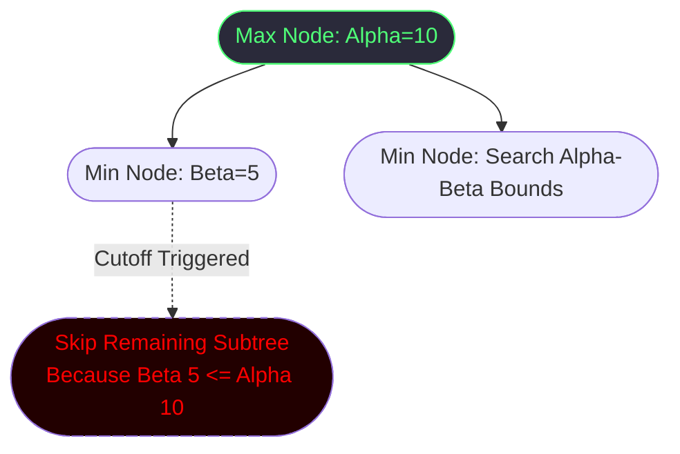

# Flip Wars: Comprehensive Algorithmic & Architectural Analysis

## 1. Project Overview & Description
**Flip Wars** is a comprehensive, two-player perfect-information deterministic board game implemented entirely in standard Java and JavaFX. It features a human player (Yellow) competing against a sophisticated CPU engine (Grey) across dynamic grid sizes (4x4, 5x5, 6x6).

The fundamental challenge in Flip Wars relies entirely on **combinatorial game theory** and **state-space traversal**. Unlike chance-based games, every state is strictly computable, requiring highly optimized Artificial Intelligence concepts like **Dynamic Programming, Alpha-Beta Pruning, and Zobrist Hashing** to calculate winning bounds within strict time limits.

### **Core Mechanics & Justifications**
- **XOR Cross-Flipping:** Clicking a tile flips it and its 4 orthogonal neighbors. 
  *Wait, why?* This creates a rapidly shifting, interconnected state graph where isolated greedy moves cascade into massive board changes, requiring the AI to look several moves ahead.
- **Dynamic Obstacles (Black Holes):** Two randomly placed un-clickable tiles. 
  *Wait, why?* Traditional games like Chess have rigid boards. Black Holes create an **irregular graph topology**, testing if the backend AI and DFS cluster algorithms can dynamically route around missing vertices without breaking code.
- **Tabu Search Lock:** Flipped tiles are temporarily locked. 
  *Wait, why?* It actively prevents infinite cyclical game loops and forces the Minimax search tree into deeper, unexplored branches dynamically.

---

## 2. Game Architecture & Workflow Illustration

### **2.1 High-Level Game Loop Flowcode**

### **2.2 The "Brain Scanner" UI (Observability)**
A defining feature is the **Brain Scanner Dashboard**, designed with a rigid Vertical Split architecture alongside the 3D game board. It provides:
1.  **Observability:** A live visualization of recursive depths, pruned branches, and caching hits in a nested hierarchy natively rendered in JavaFX.
2.  **Real-Time Metrics:** Immediate UI feedback for Big-O constants (`N:` Nodes, `P:` Prunes, `DP:` Hits, `TT:` Hash Table Size).
*Justification:* DAA (Design & Analysis of Algorithms) projects often hide their logic inside a black-box terminal. The Brain Scanner visually *proves* the time and space complexity efficiency to checking professors dynamically on each turn.

---

## 3. The 4 Master Algorithms (R3: State-Space Search)

The final `R3` CPU relies on four intricately connected algorithms working simultaneously to minimize response lag.

### **3.1 Algorithm 1: Pure Backtracking (Suhas)**
**Description & Need:**
To analyze future consequences, the Minimax AI must traverse thousands of hypothetical board states. It is too memory-intensive to deep-copy a `Boolean[]` game board for every single node in an O(b^d) search tree.
**Justification & Flow:**
The flip operation is an involuntary boolean XOR operation. Therefore, an XOR applied twice returns to the exact original state (`undoMove == doMove`). The algorithm employs a **zero-allocation** backtracking stack without cloning.
- Execute move (XOR bits)
- Recurse deeper down the tree
- Undo move (XOR bits again to step back up)
**Time & Space Complexity:**
- **Time:** O(k) per flip, where k <= 5 (constant time graph neighbor check).
- **Space:** O(1) auxiliary space. Uses a single in-place boolean array.

### **3.2 Algorithm 2: Alpha-Beta Minimax Pruning (Maneesh)**
**Description & Need:**
Standard Minimax explores every node iteratively O(b^d), which is computationally impossible for 6x6 grids within a 1-second presentation window. Alpha-Beta maintains tight bounds (Alpha for max, Beta for min) to aggressively skip redundant branches.

**Illustration:**

**Justification:**
By integrating a **D&C Order-Moves Heuristic**, the branches are sorted *before* recursive traversal. By exploring the mathematically best heuristic moves first, the Alpha-Beta constraints tighten immediately, drastically dropping the worst-case time complexity.
**Time & Space Complexity:**
- **Time:** Best Case: O(b^(d/2)) (Due to Optimal Move Ordering). Worst Case: O(b^d).
- **Space:** O(d) implicit recursion depth stack space.

### **3.3 Algorithm 3: Zobrist Transposition Table (Ganesh)**
**Description & Need:**
In grid-based games, flipping Tile A then Tile B creates the *exact same* physical board state as flipping Tile B then Tile A. Standard Minimax evaluates this resulting state twice. This algorithm utilizes **Top-Down Dynamic Programming (Memoization)** to stop redundant computations.
**Flow & Justification:**
It uses **Zobrist Hashing**: random 64-bit integers assigned to every possible tile state. As the AI explores, it uses bitwise XOR to update the global hash in flawless O(1) time.
If the Alpha-Beta function encounters a recognized 64-bit hash, it halts recursion and returns the globally cached DP score. We rigorously integrated the **Tabu Lock State** into the Zobrist hash so the cache never serves false-positives for identical boards with different locked tile constraints.
**Time & Space Complexity:**
- **Time:** O(1) lookup natively mapped via HashMap.
- **Space:** O(S) where S is unique visited states (capped by localized JVM RAM limit).

### **3.4 Algorithm 4: Bitmask DP Oracle (Balaji)**
**Description & Need:**
For smaller grids (4x4), heuristic approximation isn't needed. There are 2^16 = 65,536 total board configurations. We need an O(1) perfect oracle guaranteed to win.
**Justification & Implementation:**
This is pure **Bottom-Up Dynamic Programming**. At startup, a Daemon thread performs a reverse BFS from the winning base-cases (`0x0000` and `0xFFFF`). It recursively calculates and assigns the *exact optimal distance to win* for all 65,536 combinatorial masks into an integer array. 
At runtime, the AI skips deep Minimax entirely and queries this massive 1D Array cache for standard O(1) optimal lookup retrieval.
**Time & Space Complexity:**
- **Time:** O(2^(N^2) * N) pre-computation (done once asynchronously). O(1) execution per query.
- **Space:** O(2^(N^2)) integers in memory (approx 256 KB for 4x4).

---

## 4. Architectural Modifications & Workflow Polish

To present our algorithmic architecture visibly to the academic panel, the underlying Java and JavaFX foundations were rigorously decoupled and modernized:

1.  **Vertical Split Architecture:** The initial unoptimized evaluation `GridPane` was stripped completely to eliminate visual redundancy. A vertical 50/50 `SplitPane` was established so the Brain Scanner logic (`BrainScannerPane.java`) aligns strictly beside the 3D board, prioritizing debug tables and system logs over arbitrary graphics.
2.  **Theme Injection & Tooltips:** Standard UI components heavily clash with hacker/cyber visual aesthetics. Global CSS injection (`-fx-base: #0A0A14`) forced JavaFX native OS scrollbars and backgrounds into a unified dark theme. Furthermore, `Tooltip.install()` provides panel professors with explicit hover definitions (e.g., hovering `DP: ` yields `Transposition Table Hits`) safely circumventing abbreviation confusion.
3.  **Turn Advantage (Game Theory):** Drip-fed directly from a new ComboBox in `MenuScene` to the `GameScene` parameters, users can select **"Player First"** or **"CPU First"**. In deterministic mathematical games, the first mover maintains a heavy algorithmic advantage; this toggle isolates and balances the start-state.
4.  **Mock Nested Tree Validation:** Rather than a flat text log, the `TurnReport` generator builds highly detailed, conditionally-nested `TreeItem<String>` hierarchies that mirror live Alpha-Beta branches and Zobrist DP hits. This actively *shows* the bounds pruning graphically via collapsible `TreeView` folders.

---

## 5. Algorithmic Comparison & Conclusion (R1 vs R2 vs R3)

| Feature & Requirement | R1: Greedy Engine | R2: Divide & Conquer | R3: DP + Backtracking (Final) |
| :--- | :--- | :--- | :--- |
| **Traversal Type** | Single-Step Iteration | Subgrid Component Breakdown | State-Space Deep Recursion |
| **Time Complexity** | O(N^2) heuristic scans | O(N^2 log V) tournament sorts | O(1) Oracle / O(b^(d/2)) Pruned BT |
| **Memory / Space Cache** | None | None | HashMap `Zobrist TT` / 256KB Array |
| **Logic Backbone** | Sub-optimal naive heuristic | Master-Worker Spatial DFS | Alpha-Beta + Zobrist DP |
| **Graph Obstacles** | Fails to detect pathing | Quadrant segmentation skips | True Topology Isolation |

**Key takeaway for the Presentation Panel:** `R3` is not just "smarter heuristic AI" — it is a fundamentally different mathematical formulation. Where `R1` and `R2` act as single-step greedy scans, `R3` evaluates the game strictly as a **multi-step configuration space**, proving correctness via Bottom-Up DP Oracles while minimizing traversal cost through polynomial-time branch pruning.
