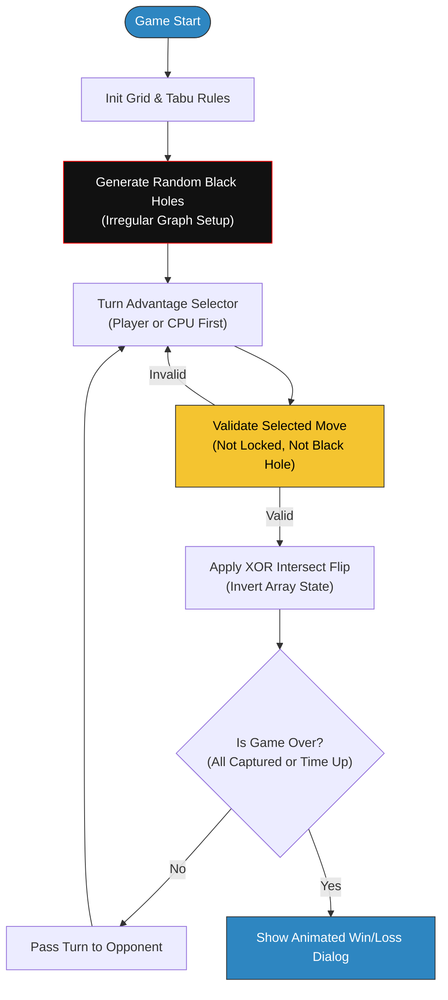
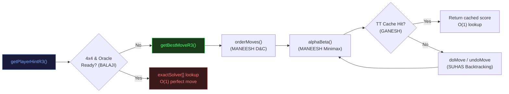
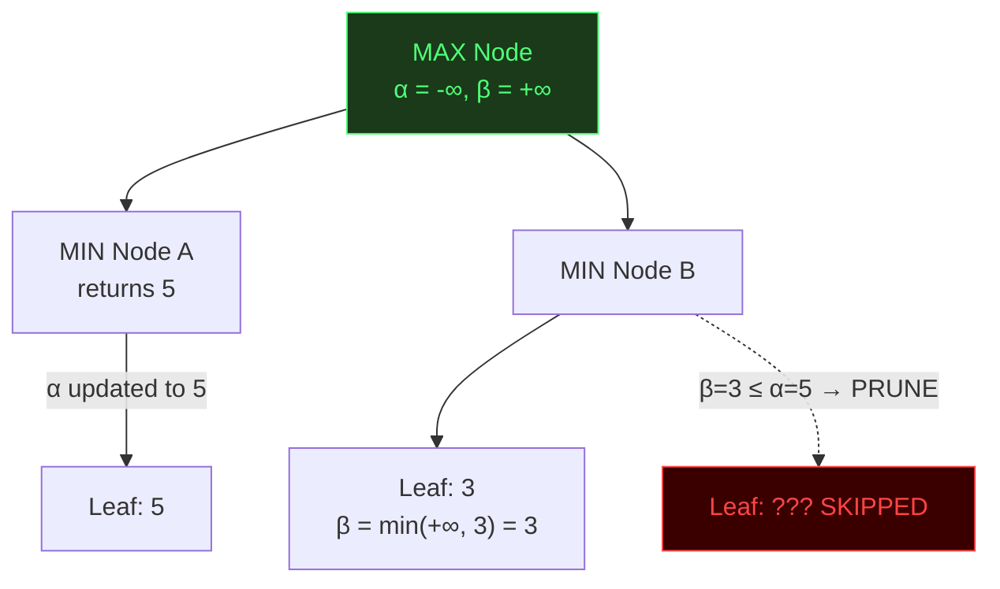

# Flip Wars: Comprehensive Algorithmic & Architectural Analysis

## 1. Project Overview & Description

**Flip Wars** is a comprehensive, two-player perfect-information deterministic board game implemented entirely in standard Java and JavaFX. It features a human player (Yellow) competing against a sophisticated CPU engine (Grey) across dynamic grid sizes (4×4, 5×5, 6×6).

The fundamental challenge in Flip Wars relies entirely on **combinatorial game theory** and **state-space traversal**. Unlike chance-based games, every state is strictly computable, requiring highly optimized AI concepts like **Dynamic Programming, Alpha-Beta Pruning, and Zobrist Hashing** to calculate winning bounds within strict time limits.

### Core Mechanics & Justifications

| Mechanic | What It Does | Why It's There |
|----------|-------------|----------------|
| **XOR Cross-Flip** | Clicking tile X flips X + its 4 orthogonal neighbors | Creates cascading board state changes — greedy single moves fail, AI must look ahead |
| **Black Holes** | 2 random un-clickable tiles per game | Produces an irregular graph topology; DFS/BFS must route around missing vertices |
| **Tabu Search Lock** | Flipped tile locked for N turns | Prevents infinite flip loops; forces Minimax tree into unexplored deeper branches |

---

## 2. Game Architecture & Workflow

### 2.1 High-Level Game Loop



### 2.2 The "Brain Scanner" UI

The **Brain Scanner Dashboard** sits in a 50/50 vertical split beside the 3D game board. It provides:

- **Observability:** Live visualization of recursive depths, pruned branches, and cache hits in a collapsible `TreeView` hierarchy.
- **Real-Time Metrics:** `N:` Nodes explored, `P:` Prunes fired, `DP:` Cache hits, `TT:` Hash table size.
- **Justification:** Visually *proves* time/space complexity to the examining panel on every single CPU turn.

#### Brain Scanner Log Sample

```
[Board Evaluation Grid] ─────────────────────
[ +25.0 ] [ +15.0 ] [ +15.0 ] [ +25.0 ]
[ +15.0 ] [  -5.0 ] [  -5.0 ] [ +15.0 ]
[ +15.0 ] [  LOCK ] [  +5.0 ] [ +15.0 ]
[ +25.0 ] [ +15.0 ] [  VOID ] [ +25.0 ]
────────────────────────────────────────────
[Alpha-Beta] Search started. Depth=6 | Moves to explore: 12
[DP Cache Hit] Zobrist hash 0xDAAF17AB → score=14.50 (depth=4, EXACT)
[Tournament D&C] Tile 3 (18.2) vs Tile 7 (14.5) → Winner: Tile 3
[Alpha-Beta] Final Champion: Tile 3  (score=18.20)
```

---

## 3. The 4 Master Algorithms (R3)

The R3 engine integrates four algorithms that collaborate inside a single recursive Minimax tree.



---

## 4. Algorithm 1 — SUHAS: Pure Backtracking

### Concept

Instead of cloning the board at every recursive call (which would use O(b^d × n) memory), the search operates on a **single shared boolean array**. Each call to `doMove` mutates the board in-place; after recursing, `undoMove` restores it exactly. This works because a boolean XOR flip is **self-inverse**: applying it twice returns to the original state.

### Code Snippet — `doMove` & `undoMove`

```java
// In R3Algorithms.java
public void doMove(boolean[] board, int move) {
    // Flip the tile and every orthogonal neighbor (including self via graph)
    for (int neighbor : graph.getNeighbors(move)) {
        if (!rules.isLocked(neighbor)) {
            board[neighbor] = !board[neighbor]; // XOR flip — its own inverse
        }
    }
}

public void undoMove(boolean[] board, int move) {
    // Identical to doMove — XOR is self-inverse.
    // Calling it again on the same tile undoes the previous doMove exactly.
    doMove(board, move);
}
```

### Usage Inside the Search Tree

```java
// Inside alphaBeta() — no board.clone() anywhere:
for (int move : moves) {
    doMove(board, move);                                  // mutate in-place
    double val = alphaBeta(board, depth-1, alpha, beta, false);
    undoMove(board, move);                                // restore perfectly
    bestScore = Math.max(bestScore, val);
}
```

### Tab Explanation

| Tab | Detail |
|-----|--------|
| **What** | In-place board mutation using XOR-flip instead of board cloning |
| **Why** | `board.clone()` at every node = O(b^d × n) memory; kills performance on 6×6 |
| **How** | `board[i] = !board[i]` twice → identity operation. `doMove ≡ undoMove` |
| **Who** | SUHAS — provides the zero-allocation backtracking stack |
| **Time** | O(k) per call, k ≤ 5 neighbors — effectively O(1) |
| **Space** | O(1) auxiliary. Single shared `boolean[]` reused at every depth level |
| **Proof** | `x XOR 1 XOR 1 = x` for every bit. No state corruption possible |

---

## 5. Algorithm 2 — MANEESH: Alpha-Beta Minimax Pruning

### Concept

Minimax builds a game tree where the **maximizer** (player) tries to get the highest score and the **minimizer** (CPU) tries to get the lowest. Alpha-Beta adds two bounds:
- **α (alpha):** Best score the maximizer is *guaranteed* so far — never goes down.
- **β (beta):** Best score the minimizer is *guaranteed* so far — never goes up.

When `β ≤ α`, the current subtree cannot affect the final result — **prune it**.

### Code Snippet — `alphaBeta` Core

```java
// In R3Algorithms.java — alphaBeta() method
private double alphaBeta(boolean[] board, int depth,
        double alpha, double beta, boolean isMaximizing) {

    // GANESH: Transposition Table lookup first (avoid recomputing)
    long hash = getBoardHash(board);
    if (ttTable.containsKey(hash)) {
        double[] entry = ttTable.get(hash);
        if (entry[1] >= depth) {         // stored at sufficient depth?
            if (entry[2] == 0) return entry[0];           // EXACT hit
            if (entry[2] == 1) alpha = Math.max(alpha, entry[0]); // lower bound
            if (entry[2] == 2) beta  = Math.min(beta,  entry[0]); // upper bound
            if (beta <= alpha) return entry[0];           // TT prune
        }
    }

    // Base case
    List<Integer> moves = getAvailableMoves();
    if (depth == 0 || moves.isEmpty()) {
        double score = evaluateLeaf(board, isMaximizing);
        ttTable.put(hash, new double[]{score, depth, 0});
        return score;
    }

    // MANEESH: order moves before recursing
    moves = orderMoves(moves, board, isMaximizing);
    double bestScore;

    if (isMaximizing) {
        bestScore = Double.NEGATIVE_INFINITY;
        for (int move : moves) {
            doMove(board, move);
            double val = alphaBeta(board, depth-1, alpha, beta, false);
            undoMove(board, move);
            bestScore = Math.max(bestScore, val);
            alpha = Math.max(alpha, bestScore);
            if (beta <= alpha) break;   // β-cut: minimizer won't choose this
        }
    } else {
        bestScore = Double.POSITIVE_INFINITY;
        for (int move : moves) {
            doMove(board, move);
            double val = alphaBeta(board, depth-1, alpha, beta, true);
            undoMove(board, move);
            bestScore = Math.min(bestScore, val);
            beta = Math.min(beta, bestScore);
            if (beta <= alpha) break;   // α-cut: maximizer won't choose this
        }
    }

    // GANESH: store to Transposition Table
    double nodeType = (bestScore <= alpha) ? 2 : (bestScore >= beta) ? 1 : 0;
    ttTable.put(hash, new double[]{bestScore, depth, nodeType});
    return bestScore;
}
```

### Code Snippet — `orderMoves` (D&C Move Ordering)

```java
// In R3Algorithms.java — Move Ordering via R2 Tournament Heuristic
private List<Integer> orderMoves(List<Integer> moves, boolean[] board, boolean forPlayer) {
    List<int[]> scored = new ArrayList<>();
    for (int move : moves) {
        boolean[] temp = board.clone();    // clone ONLY for scoring, not for search
        applyFlip(temp, move);
        double score = evaluateLeaf(temp, forPlayer);
        scored.add(new int[]{move, (int)(score * 1000)});
    }
    scored.sort((a, b) -> Integer.compare(b[1], a[1]));  // descending: best first

    List<Integer> ordered = new ArrayList<>();
    for (int[] entry : scored) ordered.add(entry[0]);
    return ordered;
}
```

### Dynamic Depth Setup

```java
// In R3Algorithms constructor
if (gridSize == 4)
    this.MAX_DEPTH = 6;   // 4x4: α-β prunes 16^6 → ~4K nodes
else if (gridSize == 5)
    this.MAX_DEPTH = 4;   // 5x5: α-β prunes 25^4 → ~19K nodes
else
    this.MAX_DEPTH = 3;   // 6x6: α-β prunes 36^3 → ~2K nodes
```

### Pruning Illustration



### Tab Explanation

| Tab | Detail |
|-----|--------|
| **What** | Recursive Minimax game-tree search with Alpha-Beta pruning |
| **Why** | Brute Minimax = O(b^d). Too slow for 6×6. α-β cuts it to O(b^(d/2)) with perfect ordering |
| **How** | α and β bounds narrow as search deepens. When β ≤ α, entire subtree is irrelevant |
| **Who** | MANEESH — owns the Alpha-Beta function and dynamic depth + D&C move ordering |
| **α bound** | Best score the maximizer (player) can guarantee. Never decreases |
| **β bound** | Best score the minimizer (CPU) can guarantee. Never increases |
| **β-cut** | Fires during MAX node: minimizer already has a better option elsewhere → skip branch |
| **α-cut** | Fires during MIN node: maximizer already has a better option elsewhere → skip branch |
| **Move Ordering** | Sorts moves by their heuristic score first. Best branches tried early → tight bounds → more pruning |
| **Time (best)** | O(b^(d/2)) — with optimal ordering this halves the effective depth |
| **Time (worst)** | O(b^d) — worst ordering, no pruning triggered |
| **Space** | O(d) — implicit call stack, one frame per depth level |

---

## 6. Algorithm 3 — GANESH: Zobrist Transposition Table

### Concept

In flip-based games, **move order doesn't matter for the resulting board state**: flipping Tile A then B gives the same board as flipping B then A. Standard Minimax re-evaluates these identical states repeatedly. The Transposition Table (TT) uses a **Zobrist Hash** to assign a unique 64-bit fingerprint to every board state, then caches evaluated scores.

### Code Snippet — `getBoardHash`

```java
// In R3Algorithms.java
private long getBoardHash(boolean[] board) {
    long hash = 0L;
    for (int i = 0; i < totalTiles; i++) {
        if (board[i])           hash ^= zobristTile[i]; // XOR in key for player-owned tile
        if (rules.isLocked(i))  hash ^= zobristLock[i]; // XOR in key for locked tile (Tabu)
    }
    return hash;
}
```

### Code Snippet — Zobrist Key Initialization

```java
// In R3Algorithms constructor
Random rng = new Random(0xDAAF17L);   // mnemonic: "DAA Flip Wars" — reproducible
zobristTile = new long[totalTiles];
zobristLock = new long[totalTiles];
for (int i = 0; i < totalTiles; i++) {
    zobristTile[i] = rng.nextLong();  // 64-bit random key per tile (owned state)
    zobristLock[i] = rng.nextLong();  // 64-bit random key per tile (lock state)
}
```

### Code Snippet — TT Lookup & Store in alphaBeta

```java
// TT lookup — at the top of every alphaBeta() call
if (ttTable.containsKey(hash)) {
    double[] entry = ttTable.get(hash);   // {score, depth, nodeType}
    if (entry[1] >= depth) {
        if (entry[2] == 0) return entry[0];    // EXACT: perfect match
        if (entry[2] == 1) alpha = Math.max(alpha, entry[0]);  // lower bound
        if (entry[2] == 2) beta  = Math.min(beta,  entry[0]);  // upper bound
        if (beta <= alpha) return entry[0];    // pruned via TT
    }
}

// TT store — after evaluating a node
double nodeType = (bestScore <= originalAlpha) ? 2  // upper bound (β-cutoff)
                : (bestScore >= beta)           ? 1  // lower bound (α-cutoff)
                :                                0;  // exact
ttTable.put(hash, new double[]{bestScore, depth, nodeType});
```

### Why Lock State Is Included in the Hash

```
Board A:  Tiles = [T F T F ...]   Locks = {}        → hash_A
Board B:  Tiles = [T F T F ...]   Locks = {tile_5}  → hash_B

hash_A ≠ hash_B   ← different legal moves, different optimal scores!
```

If locks were excluded, Board B would return Board A's cached score — which is **wrong** because tile 5 cannot be played.

### Tab Explanation

| Tab | Detail |
|-----|--------|
| **What** | Top-Down Memoization using Zobrist Hashing for O(1) board state fingerprinting |
| **Why** | Flip A→B and B→A reach the same board. Without TT, Minimax re-evaluates this exponentially often |
| **How** | Each tile has a random 64-bit key. XOR all keys for owned/locked tiles → unique 64-bit hash |
| **Who** | GANESH — owns the Zobrist array initialization, `getBoardHash()`, and TT read/write |
| **XOR property** | XOR is commutative: same tiles flipped in any order = same hash. Order-independence guaranteed |
| **Lock inclusion** | Same tiles + different locks = different legal positions = different hash. Prevents false cache hits |
| **nodeType=0** | EXACT: stored score is perfect. Return immediately |
| **nodeType=1** | Lower bound (α-cut). Adjusts alpha only |
| **nodeType=2** | Upper bound (β-cut). Adjusts beta only |
| **Collision risk** | ≈ 1/2^64 per state. Negligible for any game session |
| **Time** | O(n) hash computation, O(1) HashMap lookup |
| **Space** | O(S) where S = unique board states visited per turn. Cleared with `clearMemo()` each turn |

---

## 7. Algorithm 4 — BALAJI: Bottom-Up Bitmask DP Oracle (4×4)

### Concept

For a 4×4 board, there are exactly **2^16 = 65,536 possible board states**. Instead of using a heuristic approximation, BALAJI precomputes the **exact minimum number of moves** to reach a win from every possible state using a reverse BFS (Bottom-Up DP). This produces an O(1) perfect lookup oracle.

### Code Snippet — Oracle Precomputation (`precompute4x4Oracle`)

```java
// In R3Algorithms.java
private void precompute4x4Oracle() {
    // Build flip mask: flipMask[i] = bitmask of tiles flipped when tile i is clicked
    int[] flipMask = new int[16];
    for (int i = 0; i < 16; i++) {
        int mask = (1 << i);           // always flip self
        int row = i / 4, col = i % 4;
        if (row > 0) mask |= (1 << (i - 4)); // up
        if (row < 3) mask |= (1 << (i + 4)); // down
        if (col > 0) mask |= (1 << (i - 1)); // left
        if (col < 3) mask |= (1 << (i + 1)); // right
        flipMask[i] = mask;
    }

    // BFS from winning states outward
    Arrays.fill(exactSolver, -1);
    Queue<Integer> bfsQueue = new ArrayDeque<>();

    // Base cases: all-CPU (0x0000) and all-Player (0xFFFF) are "distance 0"
    exactSolver[0]      = 0;
    exactSolver[0xFFFF] = 0;
    bfsQueue.add(0);
    bfsQueue.add(0xFFFF);

    while (!bfsQueue.isEmpty()) {
        int state = bfsQueue.poll();
        int dist  = exactSolver[state];
        for (int tile = 0; tile < 16; tile++) {
            // XOR with flip mask = predecessor state (flip is self-inverse)
            int predecessor = state ^ flipMask[tile];
            if (exactSolver[predecessor] == -1) {
                exactSolver[predecessor] = dist + 1;
                bfsQueue.add(predecessor);
            }
        }
    }
    // Sentinel for any unreachable states
    for (int s = 0; s < 65536; s++)
        if (exactSolver[s] == -1) exactSolver[s] = Integer.MAX_VALUE;
}
```

### Code Snippet — Oracle Lookup (`getExactWinMove`)

```java
// In R3Algorithms.java — O(1) hint after precomputation
private int getExactWinMove(int boardState) {
    int bestMove = -1, bestDist = Integer.MAX_VALUE;

    for (int tile = 0; tile < 16; tile++) {
        if (rules.isLocked(tile)) continue;  // skip Tabu-locked tiles
        int row = tile/4, col = tile%4;
        int mask = (1 << tile);
        if (row > 0) mask |= (1 << (tile-4));
        if (row < 3) mask |= (1 << (tile+4));
        if (col > 0) mask |= (1 << (tile-1));
        if (col < 3) mask |= (1 << (tile+1));

        int nextState = boardState ^ mask;    // apply flip via XOR
        int dist = exactSolver[nextState];    // O(1) array lookup

        if (dist < bestDist) { bestDist = dist; bestMove = tile; }
    }
    return (bestMove == -1) ? getBestMoveR3(intToBoard(boardState), true) : bestMove;
}
```

### Code Snippet — Board ↔ Integer Conversion

```java
// BALAJI — Pack board state into a 16-bit integer
private int boardToInt(boolean[] board) {
    int state = 0;
    for (int i = 0; i < Math.min(board.length, 16); i++)
        if (board[i]) state |= (1 << i);   // bit i = 1 if player owns tile i
    return state;
}

// BALAJI — Unpack 16-bit integer back to boolean array
private boolean[] intToBoard(int state) {
    boolean[] board = new boolean[16];
    for (int i = 0; i < 16; i++)
        board[i] = ((state >> i) & 1) == 1;
    return board;
}
```

### Code Snippet — Oracle Launch (Background Thread)

```java
// In R3Algorithms constructor — non-blocking precomputation
if (gridSize == 4) {
    Thread oracleThread = new Thread(() -> {
        precompute4x4Oracle();
        oracleReady = true;
        System.out.println("[R3] 4x4 Oracle ready — 65536 states solved.");
    }, "Oracle-BFS-Thread");
    oracleThread.setDaemon(true); // killed automatically when JVM exits
    oracleThread.start();
}
```

### BFS Distance Map (Conceptual)

```
State 0xFFFF (all player) ←── distance 0  [WIN]
State 0x7FFF            ←── distance 1  (one flip away)
State 0x3FFF            ←── distance 2  (two flips away)
...
State 0xABCD            ←── distance k  (k flips to win)
```

### Tab Explanation

| Tab | Detail |
|-----|--------|
| **What** | Bottom-Up BFS over all 2^16 = 65,536 possible 4×4 board states |
| **Why** | 4×4 is small enough to precompute perfectly. No heuristic needed → guaranteed-optimal moves |
| **How** | BFS from goal states (all-one-color) outward. Every state gets tagged with fewest moves to goal |
| **Who** | BALAJI — owns `precompute4x4Oracle()`, `getExactWinMove()`, and `boardToInt/intToBoard` |
| **State encoding** | 16-bit integer: bit i = 1 if player owns tile i. 65,536 states fit in a single `int[65536]` |
| **Flip mask** | `flipMask[i]` = bitmask of all tiles toggled when tile i is clicked. Precomputed once |
| **Predecessor XOR** | Since flip is self-inverse: `predecessor = goalState XOR flipMask[tile]`. BFS works backwards |
| **`oracleReady`** | `volatile boolean` — set to true when BFS completes. Checked before every hint call |
| **Fallback** | If BFS not complete (startup lag) or grid ≠ 4 → falls back to Alpha-Beta search |
| **Pre-compute Time** | O(65536 × 16) = O(1M) operations — completes in < 50ms in background |
| **Query Time** | O(16) tile checks × O(1) array lookup = O(1) effectively |
| **Space** | O(65536) ints ≈ 256 KB for `exactSolver[]` + O(65536) for BFS queue |

---

## 8. DACAlgorithms.java — 4 D&C Heuristic Algorithms

Used for leaf-node evaluation inside `evaluateLeaf()` and for move ordering in `orderMoves()`. Each follows **Divide → Conquer → Combine**.

### 8.1 Spatial D&C — Quadrant Evaluation

#### Code Snippet

```java
// In DACAlgorithms.java
public double evaluateQuadrants(boolean[] board, int gridSize, boolean forPlayer) {
    int half = gridSize / 2;

    // DIVIDE into 4 quadrants
    double topLeft     = evaluateSubGrid(board, 0,    0,    half,           gridSize, forPlayer);
    double topRight    = evaluateSubGrid(board, 0,    half, gridSize - half, gridSize, forPlayer);
    double bottomLeft  = evaluateSubGrid(board, half, 0,    gridSize - half, gridSize, forPlayer);
    double bottomRight = evaluateSubGrid(board, half, half, gridSize - half, gridSize, forPlayer);

    // COMBINE: corner quadrants worth more (they contain actual board corners)
    double cornerWeight = 2.0;
    double edgeWeight   = 1.5;
    return (topLeft * cornerWeight) + (topRight * edgeWeight)
         + (bottomLeft * edgeWeight) + (bottomRight * cornerWeight);
}

// CONQUER step — score a single sub-grid region
private double evaluateSubGrid(boolean[] board, int startRow, int startCol,
        int size, int gridSize, boolean forPlayer) {
    double score = 0;
    for (int r = startRow; r < startRow + size && r < gridSize; r++)
        for (int c = startCol; c < startCol + size && c < gridSize; c++) {
            int id = r * gridSize + c;
            boolean isPlayerTile = board[id];
            score += forPlayer ? (isPlayerTile ? 1 : -1) : (isPlayerTile ? -1 : 1);
        }
    return score;
}
```

#### Tab Explanation

| Tab | Detail |
|-----|--------|
| **Divide** | NxN grid split into 4 equal quadrants at `gridSize/2` |
| **Conquer** | Count (our tiles) – (enemy tiles) in each quadrant independently |
| **Combine** | Weighted sum: TL/BR corners × 2.0, TR/BL edges × 1.5 |
| **Why weights** | Corner quadrants contain the high-value corner tiles (+25). Dominating them matters more |
| **Complexity** | O(n) — every tile visited exactly once total across 4 quadrants |

---

### 8.2 Structural D&C — DFS Cluster Evaluation

#### Code Snippet

```java
// In DACAlgorithms.java
public double evaluateClusters(boolean[] board, int gridSize, boolean forPlayer) {
    // DIVIDE: find all connected components via DFS
    List<Integer> clusterSizes = findClusters(board, gridSize, forPlayer);
    clusterSizes.sort(Collections.reverseOrder());

    // COMBINE: sum squared sizes of top 3 clusters
    double score = 0;
    int count = Math.min(3, clusterSizes.size());
    for (int i = 0; i < count; i++)
        score += clusterSizes.get(i) * clusterSizes.get(i); // size² = exponential reward
    return score;
}

private int dfsClusterSize(boolean[] board, boolean[] visited, int id,
        int gridSize, boolean targetColor) {
    if (id < 0 || id >= board.length || visited[id] || board[id] != targetColor)
        return 0;
    visited[id] = true;
    int size = 1;
    int row = id/gridSize, col = id%gridSize;
    if (row > 0)           size += dfsClusterSize(board, visited, id - gridSize, gridSize, targetColor);
    if (row < gridSize-1)  size += dfsClusterSize(board, visited, id + gridSize, gridSize, targetColor);
    if (col > 0)           size += dfsClusterSize(board, visited, id - 1,        gridSize, targetColor);
    if (col < gridSize-1)  size += dfsClusterSize(board, visited, id + 1,        gridSize, targetColor);
    return size;
}
```

#### Tab Explanation

| Tab | Detail |
|-----|--------|
| **Divide** | Scan all tiles; each unvisited tile of target color starts a new DFS |
| **Conquer** | DFS measures each connected island's size independently |
| **Combine** | Sum of (size²) for top 3 islands — exponential reward for large cohesive groups |
| **Why size²** | A cluster of 4 is worth 16, not 4. Incentivizes building large connected territories |
| **Black Holes** | BH tiles are always `false`. Since DFS only visits tiles matching `targetColor`, they're automatically excluded |
| **Complexity** | O(V+E) — standard DFS, each tile visited at most once |

---

### 8.3 Search Space D&C — Tournament Selection

#### Code Snippet

```java
// In DACAlgorithms.java — recursive bracket-style tournament
public int tournamentSelection(List<Integer> availableMoves, boolean[] board,
        Graph graph, Rules rules, boolean forPlayer) {
    if (availableMoves.isEmpty()) return -1;
    if (availableMoves.size() == 1) return availableMoves.get(0);  // base case

    int mid = availableMoves.size() / 2;
    List<Integer> left  = availableMoves.subList(0, mid);
    List<Integer> right = availableMoves.subList(mid, availableMoves.size());

    // DIVIDE & CONQUER: find champion of each bracket
    int leftChamp  = tournamentSelection(left,  board, graph, rules, forPlayer);
    int rightChamp = tournamentSelection(right, board, graph, rules, forPlayer);

    // COMBINE: head-to-head score comparison
    double scoreA = evaluateMove(leftChamp,  board, graph, rules, forPlayer);
    double scoreB = evaluateMove(rightChamp, board, graph, rules, forPlayer);
    int winner = (scoreA >= scoreB) ? leftChamp : rightChamp;

    // Brain Scanner log
    logger.accept(String.format(
        "[Tournament D&C] Tile %d (%.1f) vs Tile %d (%.1f) → Winner: Tile %d",
        leftChamp, scoreA, rightChamp, scoreB, winner));
    return winner;
}
```

#### Tab Explanation

| Tab | Detail |
|-----|--------|
| **Divide** | Split move list in half — left bracket vs. right bracket |
| **Conquer** | Recursively find the champion of each bracket |
| **Combine** | Two champions compared head-to-head by heuristic score; higher wins |
| **Pattern** | Same as "find max in array by D&C". n-1 total comparisons |
| **Complexity** | O(n) — each move evaluated exactly once up the recursion tree |
| **Role** | Used in R2 `getBestMoveR2()` and by R3's `orderMoves()` for sorting |

---

### 8.4 Threat Detection D&C — Quadrant Threat Analysis

#### Code Snippet

```java
// In DACAlgorithms.java
public double evaluateThreats(boolean[] board, int gridSize, boolean forPlayer) {
    int half = gridSize / 2;

    // DIVIDE into 4 quadrants
    double tl = evaluateQuadrantThreats(board, 0,    0,    half,            gridSize, forPlayer);
    double tr = evaluateQuadrantThreats(board, 0,    half, gridSize - half, gridSize, forPlayer);
    double bl = evaluateQuadrantThreats(board, half, 0,    gridSize - half, gridSize, forPlayer);
    double br = evaluateQuadrantThreats(board, half, half, gridSize - half, gridSize, forPlayer);

    // COMBINE: corner quadrants worth more to defend
    return (tl * 2.0) + (tr * 1.5) + (bl * 1.5) + (br * 2.0);
}

// CONQUER step: count exposed tiles per quadrant
private double evaluateQuadrantThreats(boolean[] board, int startRow, int startCol,
        int size, int gridSize, boolean forPlayer) {
    double ourThreats = 0, enemyThreats = 0;

    for (int r = startRow; r < startRow + size && r < gridSize; r++) {
        for (int c = startCol; c < startCol + size && c < gridSize; c++) {
            int id = r * gridSize + c;
            boolean tileIsOurs = (board[id] == forPlayer);
            int enemyNeighbors = 0;
            if (r > 0 && board[(r-1)*gridSize+c] != board[id]) enemyNeighbors++;
            if (r < gridSize-1 && board[(r+1)*gridSize+c] != board[id]) enemyNeighbors++;
            if (c > 0 && board[r*gridSize+(c-1)] != board[id]) enemyNeighbors++;
            if (c < gridSize-1 && board[r*gridSize+(c+1)] != board[id]) enemyNeighbors++;

            if (enemyNeighbors > 0) {
                if (tileIsOurs) ourThreats   += enemyNeighbors; // our tile is exposed — BAD
                else            enemyThreats += enemyNeighbors; // enemy is exposed — GOOD
            }
        }
    }
    return enemyThreats - ourThreats;  // positive = we're safer
}
```

#### Tab Explanation

| Tab | Detail |
|-----|--------|
| **Divide** | NxN grid split into 4 quadrants |
| **Conquer** | For each tile: count how many of its neighbors belong to the opponent |
| **Combine** | `(enemy exposed count) - (our exposed count)`. Weighted by quadrant importance |
| **"Threat"** | A tile with ≥1 enemy neighbor is "threatened" — it can be converted on the next flip |
| **Positive score** | Means enemy tiles are more exposed than ours — strategically favourable |
| **CPU effect** | CPU picks moves that EXPOSE player tiles while SHIELDING its own |
| **Complexity** | O(n) — each tile's 4 neighbors checked once. Space O(1) counters only |

---

## 9. Graph.java — Black Hole Aware Adjacency List

### Code Snippet — Graph Construction

```java
// In Graph.java
private void initializeGraph() {
    for (int r = 0; r < gridSize; r++) {
        for (int c = 0; c < gridSize; c++) {
            int id = r * gridSize + c;

            if (blackHoles.contains(id)) {
                adjacencyList.put(id, Collections.emptyList()); // BH: no edges in or out
                continue;
            }

            List<Integer> neighbors = new ArrayList<>();
            neighbors.add(id);           // always flip self
            addIfValid(neighbors, r-1, c); // up
            addIfValid(neighbors, r+1, c); // down
            addIfValid(neighbors, r, c-1); // left
            addIfValid(neighbors, r, c+1); // right
            adjacencyList.put(id, neighbors);
        }
    }
}

private void addIfValid(List<Integer> list, int r, int c) {
    if (r >= 0 && r < gridSize && c >= 0 && c < gridSize) {
        int neighbor = r * gridSize + c;
        if (!blackHoles.contains(neighbor))   // exclude BH: never a side-effect flip target
            list.add(neighbor);
    }
}
```

### Tab Explanation

| Tab | Detail |
|-----|--------|
| **Data Structure** | `HashMap<Integer, List<Integer>>` — tile ID → list of flip-affected tile IDs |
| **Self-inclusion** | Every tile's neighbor list includes itself. Clicking tile X always flips X |
| **Black Hole node** | Registered with `emptyList()`. Zero edges in, zero edges out — naturally excluded from all operations |
| **BH neighbor exclusion** | Adjacent tiles' lists exclude the BH too. Bidirectional isolation — BH never appears as a flip side-effect |
| **Why adjacency list** | Sparse graph (each tile has max 5 neighbors). HashMap gives O(1) lookup per tile |
| **Irregular topology** | Random BH placement creates a non-uniform graph each game. Tests AI robustness to topology changes |

---

## 10. Rules.java — Tabu Search & Strategic Weighting

### Code Snippet — Tabu Lock Mechanism

```java
// In Rules.java
public void recordMove(int tileId) {
    if (blackHoles.contains(tileId)) return;  // BH never recorded
    tabuSet.remove(tileId);    // remove if already present (reset position)
    tabuSet.add(tileId);       // add to end (most recently used)
    if (tabuSet.size() > tabuSize) {
        Iterator<Integer> it = tabuSet.iterator();
        if (it.hasNext()) { it.next(); it.remove(); }  // evict oldest
    }
}

public boolean isLocked(int tileId) {
    if (blackHoles.contains(tileId)) return true;  // BH always locked
    return tabuSet.contains(tileId);               // O(1) LinkedHashSet lookup
}
```

### Code Snippet — Strategic Tile Valuation

```java
// In Rules.java
public double getTileStrategicValue(int id) {
    if (blackHoles.contains(id)) return 0.0;   // BH: no score, no ownership

    int r = id / gridSize, c = id % gridSize;

    if ((r == 0 || r == gridSize-1) && (c == 0 || c == gridSize-1))
        return 25.0;   // Corners — most valuable
    if (r == 0 || r == gridSize-1 || c == 0 || c == gridSize-1)
        return 15.0;   // Edges
    if ((r <= 1 || r >= gridSize-2) && (c <= 1 || c >= gridSize-2))
        return -5.0;   // Near-corner traps — dangerous
    return 5.0;        // Standard interior
}
```

### Tabu Sliding Window Visualization

```
tabuSize = max(2, gridSize² / 4)
  4x4 → tabuSize = max(2, 16/4) = 4
  5x5 → tabuSize = max(2, 25/4) = 6
  6x6 → tabuSize = max(2, 36/4) = 9

After moves [3, 7, 11, 5, 2]:
  tabuSet = { 11, 5, 2, 7 }  ← 4x4 example, 4 slots
  tile 3 was evicted (oldest)
```

### Strategic Value Map (4×4 Example)

```
+25  +15  +15  +25
+15   -5   -5  +15
+15   -5   -5  +15
+25  +15  +15  +25
```

### Tab Explanation

| Tab | Detail |
|-----|--------|
| **Tabu Set** | `LinkedHashSet<Integer>` — insertion-ordered, O(1) contains/add/remove |
| **Sliding window** | When `size > tabuSize`, oldest entry (iterator head) is evicted |
| **BH in Tabu** | Black Holes are never added. They are always returned as locked via a separate `blackHoles.contains()` check |
| **Tabu purpose** | Prevents re-clicking the same tile immediately. Forces strategic variety + prevents infinite loop |
| **Corner +25** | Corners have 2 fewer neighbors → flip affects fewer tiles. High strategic control value |
| **Trap -5** | Near-corner tiles (one away from corner) — flipping them can accidentally hand corner control to opponent |
| **BH value 0** | AI never counts BH tiles as free CPU tiles or free player tiles. Zero contribution to any score |

---

## 11. Leaf Evaluation — Combined Heuristic Score

The depth-0 node score used by Alpha-Beta is a **weighted combination** of all 4 D&C algorithms:

```java
// In R3Algorithms.java — evaluateLeaf()
private double evaluateLeaf(boolean[] board, boolean forPlayer) {
    double strategic = 0;
    for (int i = 0; i < totalTiles; i++) {
        double v = rules.getTileStrategicValue(i);
        strategic += board[i] ? v : -v;
    }
    if (!forPlayer) strategic = -strategic;

    double quadrant = dac.evaluateQuadrants(board, gridSize, forPlayer);
    double cluster  = dac.evaluateClusters(board, gridSize, forPlayer)
                    - dac.evaluateClusters(board, gridSize, !forPlayer) * 1.5;
    double threat   = dac.evaluateThreats(board, gridSize, forPlayer);

    return (strategic * 0.20)   // tile positional value
         + (quadrant  * 0.25)   // territorial control
         + (cluster   * 0.25)   // cohesion / connectivity
         + (threat    * 0.30);  // exposure / vulnerability
}
```

| Component | Weight | Measures |
|-----------|--------|----------|
| `strategic` | 20% | Raw tile value sum (corners/edges/traps) |
| `quadrant` | 25% | Territorial dominance per quadrant |
| `cluster` | 25% | Connected island size — cohesion strength |
| `threat` | 30% | Exposure ratio — how vulnerable each side is |

---

## 12. Algorithmic Comparison (R1 vs R2 vs R3)

| Feature | R1: Greedy Engine | R2: Divide & Conquer | R3: DP + Backtracking |
|:--------|:------------------|:---------------------|:----------------------|
| **Traversal** | Single-step iteration | Subgrid breakdown | State-space deep recursion |
| **Time** | O(N²) | O(N² log V) | O(1) Oracle / O(b^(d/2)) |
| **Memory** | None | None | TT HashMap + 256KB Oracle |
| **Backbone** | Naive greedy heuristic | D&C tournament + DFS | α-β Minimax + Zobrist DP |
| **Black Holes** | Ignored | Skipped by quadrant split | True topology isolation via Graph |
| **Move Hint** | Best single-step tile | Best D&C tournament winner | Perfect O(1) oracle (4×4) or α-β |

> **Key Takeaway:** R3 is not "smarter heuristic AI" — it is a fundamentally different mathematical formulation. Where R1 and R2 act as single-step greedy scans, R3 evaluates the game as a **multi-step configuration space**, proving correctness via Bottom-Up DP Oracles while minimizing traversal cost via polynomial-time branch pruning.
