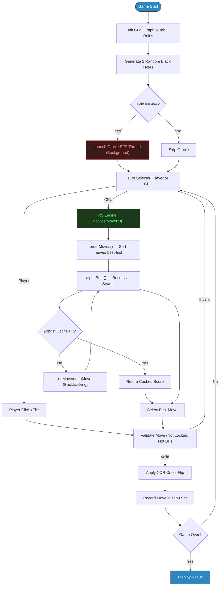
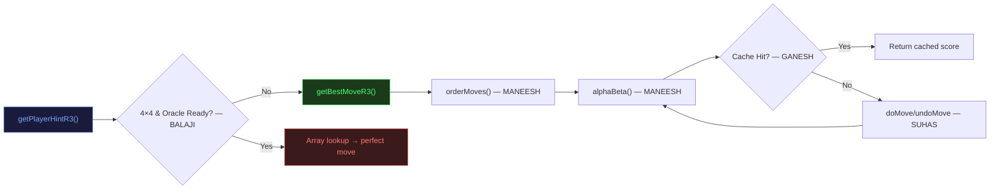
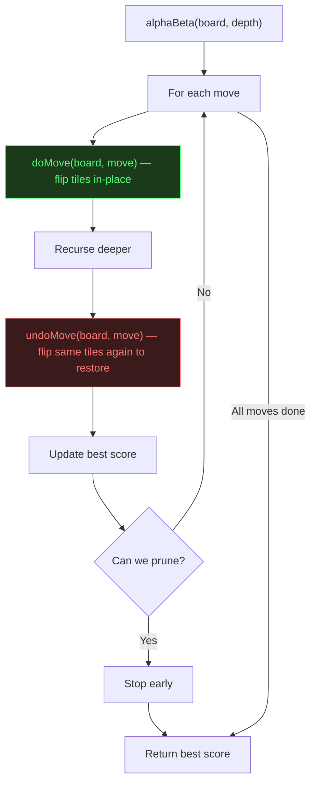
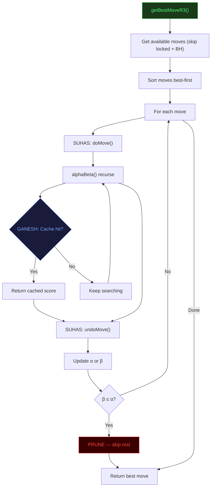
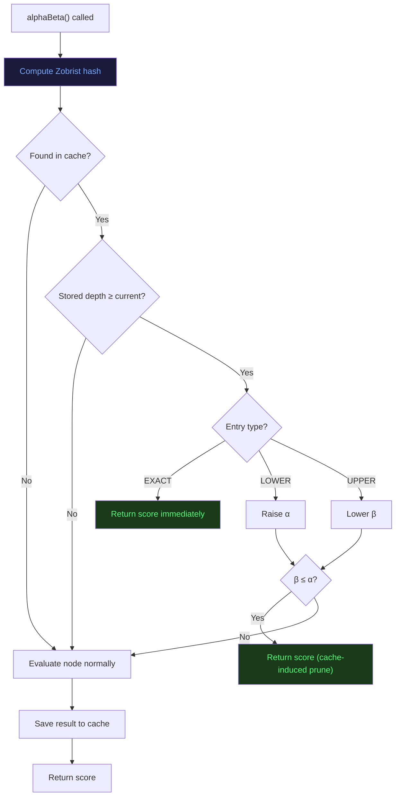
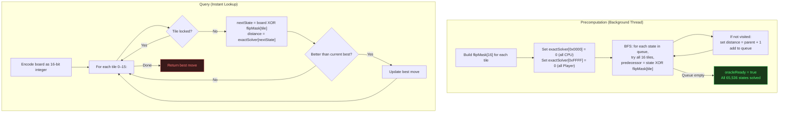

# Flip Wars: Algorithmic Analysis (R3 Engine)

**Course:** Design & Analysis of Algorithms (DAA)
**Team:** Team-13
**Engine Version:** R3 — Dynamic Programming + Backtracking

---

## Part 1: Game Introduction & Foundation

### 1.1 What is Flip Wars?

**Flip Wars** is a two-player board game built with Java and JavaFX. A human player (Yellow) plays against the CPU (Grey) on a grid (4×4, 5×5, or 6×6).

The main mechanic is the **XOR Cross-Flip**: clicking any tile flips (toggles) that tile and its 4 neighbours (up, down, left, right). Because one click affects up to 5 tiles at once, the AI needs to think several moves ahead — a simple greedy approach won't work.

Three key mechanics shape the gameplay:

| Mechanic | What It Does | Why It Matters |
|----------|-------------|----------------|
| **XOR Cross-Flip** | Clicking a tile flips it + its 4 neighbours | One move changes multiple tiles, so the AI must plan ahead |
| **Black Holes** | 2 random un-clickable tiles each game | Breaks board symmetry, forces the AI to adapt |
| **Tabu Lock** | A clicked tile is locked for the next few turns | Prevents repetitive flip-loops and forces exploration |

### 1.2 Basic Rules

| Rule | Value |
|------|-------|
| Grid Sizes | 4×4, 5×5, 6×6 |
| Black Holes | 2 per game |
| Tabu Window | 4×4 → 4 turns, 5×5 → 6 turns, 6×6 → 9 turns |
| CPU Time Limit | < 2 seconds per move |
| Win Condition | All tiles one colour, or majority when time runs out |

### 1.3 System Workflow



### 1.4 The "Brain Scanner" Dashboard

The Brain Scanner is a live panel beside the game board (using JavaFX `TreeView`) that shows:

- **Nodes explored** — how many board states the AI evaluated
- **Prunes fired** — how many branches Alpha-Beta skipped
- **Cache hits** — how many times the Zobrist table saved work
- **Tree hierarchy** — collapsible view of the AI's decision-making process

```
[Alpha-Beta] Search started. Depth=6 | Moves to explore: 12
[DP Cache Hit] Zobrist hash 0xDAAF17AB → score=14.50 (EXACT)
[Alpha-Beta] Final Champion: Tile 3  (score=18.20)
```

### 1.5 How the 4 Algorithms Work Together



---

## Part 2: Algorithm 1 — SUHAS: Zero-Allocation Backtracking

### 2.1 What is Backtracking?

**Backtracking** is a technique where you try something, go deeper, and if it doesn't work out, you **undo** your change and try the next option. Think of it like exploring a maze — if you hit a dead end, you walk back and take a different path.

The key rule: when you undo, the state must be **exactly** the same as before you tried.

### 2.2 How It Works in Flip Wars

The game board is stored as a single `boolean[]` array. A naive approach would copy the entire board at every step of the search, which wastes memory.

SUHAS's insight: since flipping a tile uses XOR (toggle), **doing the same flip twice brings you back to the original state**. So `doMove` and `undoMove` are the **same operation** — no copying needed.

```
flip once:   true  → false
flip again:  false → true   (back to original!)
```

### 2.3 Example

On a 4×4 board, clicking Tile 5 (row 1, col 1):

**Before doMove(5):**
```
[ Y ] [ G ] [ Y ] [ G ]
[ G ] [→Y←] [ G ] [ Y ]     ← Tile 5
[ Y ] [ G ] [ Y ] [ G ]
[ G ] [ Y ] [ G ] [ Y ]
```

**After doMove(5)** — Tile 5 and 4 neighbours flip:
```
[ Y ] [ Y ] [ Y ] [ G ]
[ Y ] [ G ] [ Y ] [ Y ]
[ Y ] [ Y ] [ Y ] [ G ]
[ G ] [ Y ] [ G ] [ Y ]
```

**After undoMove(5)** — same operation again → board restored exactly.

<image>Diagram showing a 4×4 grid with Tile 5 highlighted and arrows pointing to its 4 orthogonal neighbours. Three states shown left-to-right: Original → After doMove (5 tiles flipped) → After undoMove (restored to original).</image>

### 2.4 Flow Diagram



### 2.5 Code

```java
public void doMove(boolean[] board, int move) {
    for (int neighbor : graph.getNeighbors(move)) {
        if (!rules.isLocked(neighbor)) {
            board[neighbor] = !board[neighbor]; // XOR flip
        }
    }
}

public void undoMove(boolean[] board, int move) {
    doMove(board, move); // same operation — XOR is self-inverse
}
```

**Used inside Alpha-Beta:**

```java
for (int move : moves) {
    doMove(board, move);                                   // apply
    double val = alphaBeta(board, depth-1, alpha, beta, false);
    undoMove(board, move);                                 // restore
    bestScore = Math.max(bestScore, val);
    alpha = Math.max(alpha, bestScore);
    if (beta <= alpha) break; // prune
}
```

### 2.6 Rules & Constraints

| Constraint | Detail |
|-----------|--------|
| Locked tiles skipped | `doMove` checks `rules.isLocked()` — Tabu and Black Hole tiles don't flip |
| Self-included | The clicked tile always flips itself too |
| Depth limit | 4×4 → depth 6, 5×5 → depth 4, 6×6 → depth 3 |

### 2.7 Time & Space Complexity

| Metric | Complexity |
|--------|-----------|
| Time per doMove/undoMove | O(1) — flips at most 5 tiles |
| Total calls (before pruning) | O(b^d) where b = available moves, d = depth |
| Total calls (with pruning) | O(b^(d/2)) with good move ordering |
| Extra memory used | O(1) — no arrays copied |
| Call stack | O(d) — one frame per depth level |

---

## Part 3: Algorithm 2 — MANEESH: Alpha-Beta Minimax Pruning

### 3.1 What is Minimax with Alpha-Beta?

**Minimax** is a decision strategy for two-player games. It builds a tree of possible moves:
- The **Maximizer** (Player) picks the move with the highest score.
- The **Minimizer** (CPU) picks the move with the lowest score.

**Alpha-Beta Pruning** makes Minimax faster by skipping branches that can't possibly affect the final decision:
- **Alpha (α):** the best score the Maximizer can guarantee so far.
- **Beta (β):** the best score the Minimizer can guarantee so far.
- When **β ≤ α**, the rest of the branch is irrelevant — **prune it**.

### 3.2 How It Works in Flip Wars

The CPU is the Minimizer. The search depth depends on grid size (to stay under 2 seconds):

| Grid | Search Depth | Why |
|------|-------------|-----|
| 4×4 | 6 | Small board, can search deep |
| 5×5 | 4 | Medium board, moderate depth |
| 6×6 | 3 | Large board, shallow but effective |

Before searching, `orderMoves()` sorts candidate moves by a quick one-step score (best first). This helps Alpha-Beta prune more branches.

### 3.3 Example

Available moves: [0, 3, 5, 7, 10, 14]. After sorting: [3, 0, 14, 10, 5, 7].

1. **Move 3** explored fully → score 18.2. α = 18.2.
2. **Move 0** — first child of MIN subtree returns 12.0. Since 12.0 < 18.2, β ≤ α fires → **pruned**. No need to check the rest.
3. **Move 14** returns 16.5 — doesn't beat 18.2.
4. Remaining moves also below 18.2.

**Result:** Move 3 wins with score 18.2. Brain Scanner: 847 nodes explored, 312 prunes fired.

<image>A game tree with 3 levels. Root is MAX. First child (Move 3) evaluates to 18.2. Second child (Move 0) starts evaluating but gets pruned when first leaf returns 12.0 (less than α=18.2). Pruned branches shown crossed out in red.</image>

### 3.4 Flow Diagram



### 3.5 Code

```java
private double alphaBeta(boolean[] board, int depth,
        double alpha, double beta, boolean isMaximizing) {

    // Check Zobrist cache first (GANESH)
    long hash = getBoardHash(board);
    if (ttTable.containsKey(hash)) {
        double[] entry = ttTable.get(hash);
        if (entry[1] >= depth) {
            if (entry[2] == 0) return entry[0];           // exact hit
            if (entry[2] == 1) alpha = Math.max(alpha, entry[0]);
            if (entry[2] == 2) beta  = Math.min(beta,  entry[0]);
            if (beta <= alpha) return entry[0];
        }
    }

    // Base case: reached max depth or no moves left
    List<Integer> moves = getAvailableMoves();
    if (depth == 0 || moves.isEmpty()) {
        double score = evaluateLeaf(board, isMaximizing);
        ttTable.put(hash, new double[]{score, depth, 0});
        return score;
    }

    // Sort moves best-first (MANEESH)
    moves = orderMoves(moves, board, isMaximizing);
    double bestScore;

    if (isMaximizing) {
        bestScore = Double.NEGATIVE_INFINITY;
        for (int move : moves) {
            doMove(board, move);   // SUHAS backtracking
            double val = alphaBeta(board, depth - 1, alpha, beta, false);
            undoMove(board, move);
            bestScore = Math.max(bestScore, val);
            alpha = Math.max(alpha, bestScore);
            if (beta <= alpha) break; // prune
        }
    } else {
        bestScore = Double.POSITIVE_INFINITY;
        for (int move : moves) {
            doMove(board, move);
            double val = alphaBeta(board, depth - 1, alpha, beta, true);
            undoMove(board, move);
            bestScore = Math.min(bestScore, val);
            beta = Math.min(beta, bestScore);
            if (beta <= alpha) break; // prune
        }
    }

    // Store result in cache (GANESH)
    double nodeType = (bestScore <= alpha) ? 2 : (bestScore >= beta) ? 1 : 0;
    ttTable.put(hash, new double[]{bestScore, depth, nodeType});
    return bestScore;
}
```

**Move Ordering (Divide & Conquer sort):**

```java
private List<Integer> orderMoves(List<Integer> moves, boolean[] board, boolean forPlayer) {
    List<int[]> scored = new ArrayList<>();
    for (int move : moves) {
        boolean[] temp = board.clone();
        applyFlip(temp, move);
        double score = evaluateLeaf(temp, forPlayer);
        scored.add(new int[]{move, (int)(score * 1000)});
    }
    scored.sort((a, b) -> Integer.compare(b[1], a[1])); // best first

    List<Integer> ordered = new ArrayList<>();
    for (int[] entry : scored) ordered.add(entry[0]);
    return ordered;
}
```

**Depth Configuration:**

```java
if (gridSize == 4)      this.MAX_DEPTH = 6;
else if (gridSize == 5) this.MAX_DEPTH = 4;
else                    this.MAX_DEPTH = 3;
```

### 3.6 Rules & Constraints

| Constraint | Detail |
|-----------|--------|
| Depth limits | 4×4 → 6, 5×5 → 4, 6×6 → 3 (tuned for < 2s response) |
| Move ordering | Required — without it, pruning is much less effective |
| TT integration | Every node checks cache before expanding |
| Backtracking | Every `doMove` paired with `undoMove` |

### 3.7 Time & Space Complexity

| Metric | Best Case (Good Ordering) | Worst Case (Bad Ordering) |
|--------|---------------------------|---------------------------|
| Nodes Evaluated | O(b^(d/2)) | O(b^d) |
| Space (Call Stack) | O(d) | O(d) |
| Space (Cache) | O(S) where S = unique states visited | Same |

**Concrete numbers:**

| Grid | Moves (b) | Depth (d) | Without Pruning (b^d) | With Pruning (b^(d/2)) | Speedup |
|------|-----------|-----------|----------------------|------------------------|---------|
| 4×4 | 14 | 6 | 7,529,536 | 2,744 | ~2,745× |
| 5×5 | 23 | 4 | 279,841 | 529 | ~529× |
| 6×6 | 34 | 3 | 39,304 | ~198 | ~198× |

---

## Part 4: Algorithm 3 — GANESH: Zobrist Transposition Table

### 4.1 What is a Transposition Table?

A **Transposition Table (TT)** is a cache that stores previously evaluated board states. If the AI reaches the same board state through a different sequence of moves (a "transposition"), it can look up the stored result instantly instead of re-evaluating.

**Zobrist Hashing** is the technique used to fingerprint board states. Each tile gets a random 64-bit number. The hash of any board is computed by XOR-ing together the numbers for all player-owned tiles. Because XOR is order-independent, different move sequences that reach the same board produce the same hash.

### 4.2 How It Works in Flip Wars

Different move sequences can lead to the same board (e.g., flipping Tile 3 then Tile 7 gives the same result as Tile 7 then Tile 3). Without a cache, the AI would evaluate these duplicate states multiple times.

GANESH's system:

1. **Setup:** Generate random 64-bit keys for each tile (for ownership and for lock state), using a fixed seed for reproducibility.
2. **Hash:** XOR all active keys together to fingerprint the board state.
3. **Store:** When a state is fully evaluated, save `{score, depth, type}` in a `HashMap`.
4. **Lookup:** Before evaluating any node, check the cache first. If found at sufficient depth, return the cached result.

The cache stores three types of entries:
- **EXACT:** The stored score is the precise minimax value.
- **LOWER BOUND:** The score is at least this value (α-cutoff happened).
- **UPPER BOUND:** The score is at most this value (β-cutoff happened).

Lock state is included in the hash because boards with the same tiles but different locked tiles have different legal moves.

### 4.3 Example

The AI explores [Tile 3, Tile 7] and evaluates the resulting board → stores score 14.50.

Later, a different branch explores [Tile 7, Tile 3] — same board state, same hash.

```
Path A: doMove(3) → doMove(7) → hash = 0xDAAF17AB
Path B: doMove(7) → doMove(3) → hash = 0xDAAF17AB  (same!)
```

Path B finds the cached result → returns 14.50 instantly. No subtree evaluation needed.

<image>Two branches of a game tree converging to the same board state. Path A goes Tile 3 → Tile 7 → State S. Path B goes Tile 7 → Tile 3 → State S. An arrow from State S points to a cache entry {score=14.50, EXACT}. Path B's subtree is greyed out with a "CACHE HIT" label.</image>

### 4.4 Flow Diagram



### 4.5 Code

**Zobrist Key Setup:**

```java
Random rng = new Random(0xDAAF17L);   // fixed seed for reproducibility
zobristTile = new long[totalTiles];
zobristLock = new long[totalTiles];
for (int i = 0; i < totalTiles; i++) {
    zobristTile[i] = rng.nextLong();  // random key per tile (ownership)
    zobristLock[i] = rng.nextLong();  // random key per tile (lock state)
}
```

**Hash Computation:**

```java
private long getBoardHash(boolean[] board) {
    long hash = 0L;
    for (int i = 0; i < totalTiles; i++) {
        if (board[i])           hash ^= zobristTile[i]; // player-owned
        if (rules.isLocked(i))  hash ^= zobristLock[i]; // locked
    }
    return hash;
}
```

**Cache Lookup & Store (inside alphaBeta):**

```java
// Lookup — at the top of alphaBeta()
long hash = getBoardHash(board);
if (ttTable.containsKey(hash)) {
    double[] entry = ttTable.get(hash);
    if (entry[1] >= depth) {
        if (entry[2] == 0) return entry[0];           // EXACT
        if (entry[2] == 1) alpha = Math.max(alpha, entry[0]); // LOWER
        if (entry[2] == 2) beta  = Math.min(beta,  entry[0]); // UPPER
        if (beta <= alpha) return entry[0];
    }
}

// Store — after evaluating a node
double nodeType = (bestScore <= originalAlpha) ? 2
                : (bestScore >= beta)           ? 1
                :                                0;
ttTable.put(hash, new double[]{bestScore, depth, nodeType});
```

### 4.6 Rules & Constraints

| Constraint | Detail |
|-----------|--------|
| Depth check | Cached entry only used if stored at ≥ current depth |
| Lock state included | Same tiles + different locks = different hash (different legal moves) |
| Cleared per turn | Cache wiped at start of each CPU turn (Tabu state changes between turns) |
| Collision chance | ~1 in 2^64 per pair — negligible |

### 4.7 Time & Space Complexity

| Metric | Complexity |
|--------|-----------|
| Hash computation | O(n²) — one pass over all tiles |
| Cache lookup | O(1) — HashMap get |
| Cache store | O(1) — HashMap put |
| Cache size | O(S) where S = unique states visited per turn |

---

## Part 5: Algorithm 4 — BALAJI: Bottom-Up Bitmask DP Oracle (4×4 Only)

### 5.1 What is Bottom-Up DP with Bitmasks?

**Bottom-Up Dynamic Programming** solves a problem by first solving all the small cases, storing results in a table, and building up to the answer.

**Bitmask DP** represents states as integers where each bit is a yes/no flag. For a 4×4 board with 16 tiles, each tile is either Player or CPU — so every possible board state fits in a 16-bit integer. That's only 65,536 total states.

**Reverse BFS** starts from the goal states (all tiles one colour) and works backwards, computing the minimum number of moves to reach the goal from every reachable state.

### 5.2 How It Works in Flip Wars

For the 4×4 grid only, BALAJI precomputes "how many moves to win?" for **every possible board state** using reverse BFS. This creates a perfect **Oracle**: given any board, the best move is found by a simple array lookup.

Why it works: XOR flips are reversible. If board A becomes board B by clicking tile T, then board B also becomes board A by clicking tile T. So BFS backwards from goal states finds optimal distances for everything.

**How it integrates:**
- Precomputed on a background thread when the game starts.
- When the player asks for a hint on 4×4 and the Oracle is ready → instant perfect answer.
- If not ready yet, or on 5×5/6×6 → falls back to Alpha-Beta.

### 5.3 Example

Player requests a hint. Board state encoded as integer `0xAAAA`.

1. For each tile (0–15), compute: `nextState = currentState XOR flipMask[tile]`
2. Look up `exactSolver[nextState]` — precomputed distance to win.
3. Pick the tile with the smallest distance.

Result: Tile 5 → distance 3 (minimum). Oracle says: "Click Tile 5 — 3 moves to win."

<image>Flowchart: (1) Current board encoded as 0xAAAA. (2) For each tile, XOR with flipMask produces a nextState. (3) Each nextState maps to an array lookup showing the distance. (4) Tile 5 with distance 3 is highlighted as the optimal choice.</image>

### 5.4 Flow Diagram



### 5.5 Code

**Oracle Precomputation:**

```java
private void precompute4x4Oracle() {
    // Build flip mask for each tile
    int[] flipMask = new int[16];
    for (int i = 0; i < 16; i++) {
        int mask = (1 << i);           // always flip self
        int row = i / 4, col = i % 4;
        if (row > 0) mask |= (1 << (i - 4)); // up
        if (row < 3) mask |= (1 << (i + 4)); // down
        if (col > 0) mask |= (1 << (i - 1)); // left
        if (col < 3) mask |= (1 << (i + 1)); // right
        flipMask[i] = mask;
    }

    // BFS from goal states backwards
    Arrays.fill(exactSolver, -1);
    Queue<Integer> bfsQueue = new ArrayDeque<>();

    exactSolver[0]      = 0;  // all CPU  → distance 0
    exactSolver[0xFFFF] = 0;  // all Player → distance 0
    bfsQueue.add(0);
    bfsQueue.add(0xFFFF);

    while (!bfsQueue.isEmpty()) {
        int state = bfsQueue.poll();
        int dist  = exactSolver[state];
        for (int tile = 0; tile < 16; tile++) {
            int predecessor = state ^ flipMask[tile]; // XOR = reverse step
            if (exactSolver[predecessor] == -1) {
                exactSolver[predecessor] = dist + 1;
                bfsQueue.add(predecessor);
            }
        }
    }
}
```

**Oracle Query:**

```java
private int getExactWinMove(int boardState) {
    int bestMove = -1, bestDist = Integer.MAX_VALUE;

    for (int tile = 0; tile < 16; tile++) {
        if (rules.isLocked(tile)) continue;
        int row = tile / 4, col = tile % 4;
        int mask = (1 << tile);
        if (row > 0) mask |= (1 << (tile - 4));
        if (row < 3) mask |= (1 << (tile + 4));
        if (col > 0) mask |= (1 << (tile - 1));
        if (col < 3) mask |= (1 << (tile + 1));

        int nextState = boardState ^ mask;
        int dist = exactSolver[nextState];  // O(1) lookup

        if (dist < bestDist) { bestDist = dist; bestMove = tile; }
    }
    return (bestMove == -1) ? getBestMoveR3(intToBoard(boardState), true) : bestMove;
}
```

**Background Thread Launch:**

```java
if (gridSize == 4) {
    Thread oracleThread = new Thread(() -> {
        precompute4x4Oracle();
        oracleReady = true;
    }, "Oracle-BFS-Thread");
    oracleThread.setDaemon(true);
    oracleThread.start();
}
```

### 5.6 Rules & Constraints

| Constraint | Detail |
|-----------|--------|
| 4×4 only | 5×5 has 33M states (too large), 6×6 has 68 billion (impossible) |
| Tabu awareness | Locked tiles skipped at query time |
| Background thread | Non-blocking — game playable immediately |
| Fallback | If Oracle not ready or grid ≠ 4×4 → uses Alpha-Beta instead |

### 5.7 Time & Space Complexity

| Metric | Complexity |
|--------|-----------|
| Precomputation time | O(65,536 × 16) ≈ 1 million operations (< 50ms) |
| Precomputation space | 65,536 integers = 256 KB |
| Query time per hint | O(16) = O(1) effectively |

**Why only 4×4?**

| Grid | States | Memory Needed | Feasible? |
|------|--------|---------------|-----------|
| 4×4 | 65,536 | 256 KB | Yes |
| 5×5 | 33,554,432 | 128 MB | Borderline |
| 6×6 | 68,719,476,736 | 256 GB | No |

---

## Appendix A: Leaf Evaluation — Combined Heuristic Score

When Alpha-Beta reaches its depth limit, it evaluates the board using a weighted combination of 4 heuristic components:

```java
private double evaluateLeaf(boolean[] board, boolean forPlayer) {
    double strategic = 0;
    for (int i = 0; i < totalTiles; i++) {
        double v = rules.getTileStrategicValue(i);
        strategic += board[i] ? v : -v;
    }
    if (!forPlayer) strategic = -strategic;

    double quadrant = dac.evaluateQuadrants(board, gridSize, forPlayer);
    double cluster  = dac.evaluateClusters(board, gridSize, forPlayer)
                    - dac.evaluateClusters(board, gridSize, !forPlayer) * 1.5;
    double threat   = dac.evaluateThreats(board, gridSize, forPlayer);

    return (strategic * 0.20)
         + (quadrant  * 0.25)
         + (cluster   * 0.25)
         + (threat    * 0.30);
}
```

| Component | Weight | What It Measures |
|-----------|--------|-----------------|
| Strategic | 20% | Tile positional value (corners +25, edges +15, traps -5) |
| Quadrant | 25% | Territorial dominance per board quarter |
| Cluster | 25% | Connected group cohesion |
| Threat | 30% | How vulnerable each side is to flips |

---

## Appendix B: Supporting Infrastructure

### B.1 Graph.java — Adjacency List with Black Holes

```java
private void initializeGraph() {
    for (int r = 0; r < gridSize; r++) {
        for (int c = 0; c < gridSize; c++) {
            int id = r * gridSize + c;
            if (blackHoles.contains(id)) {
                adjacencyList.put(id, Collections.emptyList());
                continue;
            }
            List<Integer> neighbors = new ArrayList<>();
            neighbors.add(id);             // always flip self
            addIfValid(neighbors, r-1, c); // up
            addIfValid(neighbors, r+1, c); // down
            addIfValid(neighbors, r, c-1); // left
            addIfValid(neighbors, r, c+1); // right
            adjacencyList.put(id, neighbors);
        }
    }
}
```

- Black Hole nodes get an empty neighbour list — completely isolated.
- Adjacent tiles exclude Black Holes from their lists.
- O(n²) to build, O(1) to look up a tile's neighbours.

### B.2 Rules.java — Tabu Lock & Tile Values

```java
public void recordMove(int tileId) {
    if (blackHoles.contains(tileId)) return;
    tabuSet.remove(tileId);
    tabuSet.add(tileId);
    if (tabuSet.size() > tabuSize) {
        Iterator<Integer> it = tabuSet.iterator();
        if (it.hasNext()) { it.next(); it.remove(); }
    }
}

public boolean isLocked(int tileId) {
    if (blackHoles.contains(tileId)) return true;
    return tabuSet.contains(tileId);
}
```

- Tabu Set uses `LinkedHashSet` (insertion-ordered, O(1) operations).
- Window size: 4×4 → 4, 5×5 → 6, 6×6 → 9.
- Tile values: Corners +25, Edges +15, Traps -5, Interior +5, Black Holes 0.

---

## Appendix C: Comparison — R1 vs R2 vs R3

| Feature | R1: Greedy | R2: Divide & Conquer | R3: DP + Backtracking |
|---------|-----------|---------------------|----------------------|
| Traversal | Single-step | Subgrid breakdown | Deep state-space recursion |
| Planning Depth | 1 move ahead | 1 move (better heuristics) | 3–6 moves ahead |
| Core Technique | Greedy selection | Divide & Conquer scoring | Minimax + Alpha-Beta + DP |
| Memory | O(n²) | O(n²) | O(n²) + cache |
| AI Strength | Weak | Medium | Strong |
| Time per Move | O(n²) | O(n² log n) | O(b^(d/2) · n²) |
| Can Be Beaten? | Easily | Sometimes | Rarely on 4×4 (Oracle is perfect) |
